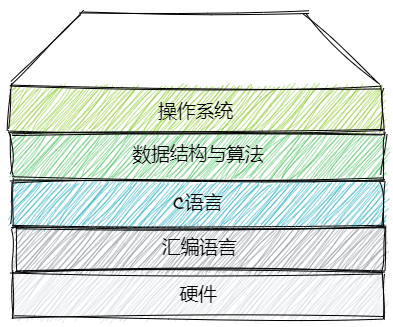

## 前言

操作系统，作为人类当前创造出来的最复杂的系统，其蕴含了大量精巧的设计。完全理解操作系统，应该是每一个程序员都想做的事情，但是每当我们想要去学习操作系统，了解其奥秘时，都会被里面 晦涩难懂的设计和一些闻所未闻的名词劝退。即使没有被劝退，非常痛苦的看完一本晦涩难懂的操作系统的书籍后，也会发现自己好像只是理解了一点操作系统的皮毛，并没有对其有一个很透彻的理解。而且时间长了之后，那些好不容易学到的"皮毛"也会被时间带来的“遗忘之风”吹散。

而且操作系统不仅要求对底层的硬件知识有一定的了解，对于汇编语言、C语言、数据结构与算法都需要有一定的基础。这些基础里面任何一个看起来都需要很长的时间去学习。因此完全理解操作系统，变成了一件非常非常困难的事情。而且在国内，由于操作系统的相关书籍水平参差不齐，大学的课程也大都将多个科目分开讲授，没有从实践的角度去解释清楚各个科目之间的联系，因此完全理解操作系统更是变得尤其困难。

但是近几年随着国内教育的变革，以及国内一些年轻的、怀着理想的程序员们可以在视频软件(如：B站) 上发布自己对一些知识的理解，并尝试用十分通俗易懂且形象的方式将其呈现出来。“星星之火，可以燎原。”这些微小的变化与努力汇集到一起，使得我们如果想要系统性地学习与了解操作系统，变得没有那么困难。下面是我自己整理的一些课程：

[编程前你最好了解的基本硬件和计算机基础知识（模拟电路）](https://www.bilibili.com/video/BV1774114798?spm_id_from=333.999.0.0)

[编程前你最好了解的基本硬件和计算机基础知识（数字电路）](https://www.bilibili.com/video/BV1Hi4y1t7zY?spm_id_from=333.999.0.0)

[从0到1设计一台计算机](https://www.bilibili.com/video/BV1wi4y157D3?spm_id_from=333.999.0.0)

[北京大学精品公开课：计算机组成与设计](https://www.bilibili.com/video/BV1tp4y197Av?spm_id_from=333.999.0.0)

[操作系统（哈工大李治军老师）](https://www.bilibili.com/video/BV1d4411v7u7?spm_id_from=333.999.0.0)

[《一个64位操作系统的设计与实现》](https://book.douban.com/subject/30222325/)

[深入理解计算机系统（动画视频）](https://www.bilibili.com/video/BV1cD4y1D7uR?spm_id_from=333.999.0.0)

[深入理解计算机系统（原书第3版）](https://www.baidu.com/link?url=LJBXAsJR1IDH_HU4Tnx1pUI25c7bjsIFAUxJQ61zheYRSsQqB2_5j8CKu-fYwdKHhvU3qsLeMPd7eW6_MS4K2a&wd=&eqid=92946e37000e3797000000066280ca29)

这些课程大多形象具体，老师们授课由浅入深，风格诙谐幽默，让晦涩难懂的东西变得通俗易懂。另一方面，老师们的课程也不仅仅局限于将技术讲明白，更多地是将整个计算机的历史娓娓道来，讲述了一个简单的开闭电路如何一步一步构造成如今这个几乎无所不能的计算机。整个过程中，我们会发现原来计算机的历史不只是微软抄袭了苹果的某些技术，苹果又剽窃了某某实验室的技术。这些或许只是整个计算机发展长河里的一个很小的浪花，而在这条长河里我们会看到的是 前辈们一个踩在另一个人的肩膀上，汇聚成一个庞大的巨人，他们每一个人都是这个巨人的一部分，每一个人都让这个巨人的高度再增加那么一点。 而老师们带着我们一步一步领略这个巨人的智慧，大家可以按照 模电——> 数电 ——> 从0到1设计与实现计算机——> 计算机组成原理(北大)——>操作系统(哈工大)——>《一个64位操作系统的设计与实现》的顺序，并以《深入理解计算机系统》为辅助材料来进行学习。诚然，这是一个漫长的过程，但是大家按照这个顺序去学习，必然会有一定的收获。快餐式的学习一定会伴随着快餐式的遗忘，唯有缓慢地长期地系统性地学习才会为自己带来真正的成长，对一些知识也会有自己的理解。另外系统性地了解过去，站在现在的节点才能更好地看到未来，而不置于被当下一些迷雾所蒙蔽，看不到整个计算机依然宏伟的未来。

而本项目除了介绍上面这些课程以外，主要记录了操作系统的学习过程中对于李治军老师讲授的操作系统课程中的 linux0.1.1进行扩展的一些实验说明及代码，以及通过阅读《一个64位操作系统的设计及实现》来自己编写的一个64位的操作系统，同时记录了自己实现过程的一些自己的想法与收获。如果哪些地方有问题，也欢迎各位指出来，一起进行学习与讨论。

## 项目结构说明

- linux-0.1.1-labs : 在linux-0.1.1上做的一些实验。
- Without-OS ：自己编写的完整的64位操作系统。
