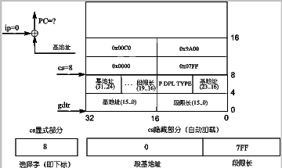

# 基于内核栈切换的进程切换
## 课程说明
本实验是 操作系统之进程与线程 - 网易云课堂 的配套实验，推荐大家进行实验之前先学习相关课程：

- L10 用户级线程
- L11 内核级线程
- L12 核心级线程实现实例
- L13 操作系统的那棵树

> Tips：点击上方文字中的超链接或者输入 https://mooc.study.163.com/course/1000002008#/info 进入理论课程的学习。 如果网易云上的课程无法查看，也可以看 Bilibili 上的 操作系统哈尔滨工业大学李治军老师。

## 实验目的
- 深入理解进程和进程切换的概念；
- 综合应用进程、CPU 管理、PCB、LDT、内核栈、内核态等知识解决实际问题；
- 开始建立系统认识。

## 实验内容
现在的 Linux 0.11 采用 TSS（后面会有详细论述）和一条指令就能完成任务切换，虽然简单，但这指令的执行时间却很长，在实现任务切换时大概需要 200 多个时钟周期。

而通过堆栈实现任务切换可能要更快，而且采用堆栈的切换还可以使用指令流水的并行优化技术，同时又使得 CPU 的设计变得简单。所以无论是 Linux 还是 Windows，进程/线程的切换都没有使用 Intel 提供的这种 TSS 切换手段，而都是通过堆栈实现的。

本次实践项目就是将 Linux 0.11 中采用的 TSS 切换部分去掉，取而代之的是基于堆栈的切换程序。具体的说，就是将 Linux 0.11 中的 switch_to 实现去掉，写成一段基于堆栈切换的代码。

本次实验包括如下内容：

- 编写汇编程序 switch_to：
- 完成主体框架；
- 在主体框架下依次完成 PCB 切换、内核栈切换、LDT 切换等；
- 修改 fork()，由于是基于内核栈的切换，所以进程需要创建出能完成内核栈切换的样子。
- 修改 PCB，即 task_struct 结构，增加相应的内容域，同时处理由于修改了 task_struct 所造成的影响。
- 用修改后的 Linux 0.11 仍然可以启动、可以正常使用。
- （选做）分析实验 3 的日志体会修改前后系统运行的差别。
## 实验提示
本次实验将 Linux 0.11 中采用的 TSS 切换部分去掉，取而代之的是基于堆栈的切换程序。具体的说，就是将 Linux 0.11 中的 switch_to （在 kernal/system_call.s 中）实现去掉，写成一段基于堆栈切换的代码。
### TSS 切换
在现在的 Linux 0.11 中，真正完成进程切换是依靠任务状态段（Task State Segment，简称 TSS）的切换来完成的。

具体的说，在设计“Intel 架构”（即 x86 系统结构）时，每个任务（进程或线程）都对应一个独立的 TSS，TSS 就是内存中的一个结构体，里面包含了几乎所有的 CPU 寄存器的映像。有一个任务寄存器（Task Register，简称 TR）指向当前进程对应的 TSS 结构体，所谓的 TSS 切换就将 CPU 中几乎所有的寄存器都复制到 TR 指向的那个 TSS 结构体中保存起来，同时找到一个目标 TSS，即要切换到的下一个进程对应的 TSS，将其中存放的寄存器映像“扣在” CPU 上，就完成了执行现场的切换，如下图所示。


Intel 架构不仅提供了 TSS 来实现任务切换，而且只要一条指令就能完成这样的切换，即图中的 `ljmp` 指令。

具体的工作过程是：

- （1）首先用 TR 中存取的段选择符在 GDT 表中找到当前 TSS 的内存位置，由于 TSS 是一个段，所以需要用段表中的一个描述符来表示这个段，和在系统启动时论述的内核代码段是一样的，那个段用 GDT 中的某个表项来描述，还记得是哪项吗？是 8 对应的第 1 项。此处的 TSS 也是用 GDT 中的某个表项描述，而 TR 寄存器是用来表示这个段用 GDT 表中的哪一项来描述，所以 TR 和 CS、DS 等寄存器的功能是完全类似的。
- （2）找到了当前的 TSS 段（就是一段内存区域）以后，将 CPU 中的寄存器映像存放到这段内存区域中，即拍了一个快照。
- （3）存放了当前进程的执行现场以后，接下来要找到目标进程的现场，并将其扣在 CPU 上，找目标 TSS 段的方法也是一样的，因为找段都要从一个描述符表中找，描述 TSS 的描述符放在 GDT 表中，所以找目标 TSS 段也要靠 GDT 表，当然只要给出目标 TSS 段对应的描述符在 GDT 表中存放的位置——段选择子就可以了，仔细想想系统启动时那条著名的 `jmpi 0, 8` 指令，这个段选择子就放在 `ljmp` 的参数中，实际上就 `jmpi 0, 8` 中的 8。
- （4）一旦将目标 TSS 中的全部寄存器映像扣在 CPU 上，就相当于切换到了目标进程的执行现场了，因为那里有目标进程停下时的 CS:EIP，所以此时就开始从目标进程停下时的那个 CS:EIP 处开始执行，现在目标进程就变成了当前进程，所以 TR 需要修改为目标 TSS 段在 GDT 表中的段描述符所在的位置，因为 TR 总是指向当前 TSS 段的段描述符所在的位置。
上面给出的这些工作都是一句长跳转指令 `ljmp 段内偏移,段选择子，在段选择子指向的段描述符是 TSS 段时 CPU 解释执行的结果，所以基于 TSS 进行进程/线程切换的 switch_to 实际上就是一句 ljmp 指令：
```c
#define switch_to(n) {
    struct{long a,b;} tmp;
    __asm__(
        "movw %%dx,%1"
        "ljmp %0" ::"m"(*&tmp.a), "m"(*&tmp.b), "d"(TSS(n)
    )
 }

#define FIRST_TSS_ENTRY 4

#define TSS(n) (((unsigned long) n) << 4) + (FIRST_TSS_ENTRY << 3))
```
GDT 表的结构如下图所示，所以第一个 TSS 表项，即 0 号进程的 TSS 表项在第 4 个位置上，4<<3，即 `4 * 8`，相当于 TSS 在 GDT 表中开始的位置，TSS（n）找到的是进程 n 的 TSS 位置，所以还要再加上 `n<<4`，即 `n * 16`，因为每个进程对应有 1 个 TSS 和 1 个 LDT，每个描述符的长度都是 8 个字节，所以是乘以 16，其中 LDT 的作用就是上面论述的那个映射表，关于这个表的详细论述要等到内存管理一章。`TSS(n) = n * 16 + 4 * 8`，得到就是进程 n（切换到的目标进程）的 TSS 选择子，将这个值放到 dx 寄存器中，并且又放置到结构体 tmp 中 32 位长整数 b 的前 16 位，现在 64 位 tmp 中的内容是前 32 位为空，这个 32 位数字是段内偏移，就是 `jmpi 0, 8` 中的 0；接下来的 32 位是 `n * 16 + 4 * 8`，这个数字是段选择子，就是 `jmpi 0, 8` 中的 8。所以 switch_to 的核心实际上就是 ljmp 空, `n*16+4*8`，现在和前面给出的基于 TSS 的进程切换联系在一起了。


### 本次实验的内容
虽然用一条指令就能完成任务切换，但这指令的执行时间却很长，这条 ljmp 指令在实现任务切换时大概需要 200 多个时钟周期。而通过堆栈实现任务切换可能要更快，而且采用堆栈的切换还可以使用指令流水的并行优化技术，同时又使得 CPU 的设计变得简单。所以无论是 Linux 还是 Windows，进程/线程的切换都没有使用 Intel 提供的这种 TSS 切换手段，而都是通过堆栈实现的。

本次实践项目就是将 Linux 0.11 中采用的 TSS 切换部分去掉，取而代之的是基于堆栈的切换程序。具体的说，就是将 Linux 0.11 中的 switch_to 实现去掉，写成一段基于堆栈切换的代码。

在现在的 Linux 0.11 中，真正完成进程切换是依靠任务状态段（Task State Segment，简称 TSS）的切换来完成的。具体的说，在设计“Intel 架构”（即 x86 系统结构）时，每个任务（进程或线程）都对应一个独立的 TSS，TSS 就是内存中的一个结构体，里面包含了几乎所有的 CPU 寄存器的映像。有一个任务寄存器（Task Register，简称 TR）指向当前进程对应的 TSS 结构体，所谓的 TSS 切换就将 CPU 中几乎所有的寄存器都复制到 TR 指向的那个 TSS 结构体中保存起来，同时找到一个目标 TSS，即要切换到的下一个进程对应的 TSS，将其中存放的寄存器映像“扣在”CPU 上，就完成了执行现场的切换。

要实现基于内核栈的任务切换，主要完成如下三件工作：

- （1）重写 switch_to；
- （2）将重写的 switch_to 和 schedule() 函数接在一起；
- （3）修改现在的 fork()。
### schedule 与 switch_to
目前 Linux 0.11 中工作的 `schedule()` 函数是首先找到下一个进程的数组位置 next，而这个 next 就是 GDT 中的 n，所以这个 next 是用来找到切换后目标 TSS 段的段描述符的，一旦获得了这个 next 值，直接调用上面剖析的那个宏展开 `switch_to(next)`;就能完成如图 TSS 切换所示的切换了。

现在，我们不用 TSS 进行切换，而是采用切换内核栈的方式来完成进程切换，所以在新的 switch_to 中将用到当前进程的 PCB、目标进程的 PCB、当前进程的内核栈、目标进程的内核栈等信息。由于 Linux 0.11 进程的内核栈和该进程的 PCB 在同一页内存上（一块 4KB 大小的内存），其中 PCB 位于这页内存的低地址，栈位于这页内存的高地址；另外，由于当前进程的 PCB 是用一个全局变量 current 指向的，所以只要告诉新 `switch_to()` 函数一个指向目标进程 PCB 的指针就可以了。同时还要将 next 也传递进去，虽然 TSS(next)不再需要了，但是 LDT(next)仍然是需要的，也就是说，现在每个进程不用有自己的 TSS 了，因为已经不采用 TSS 进程切换了，但是每个进程需要有自己的 LDT，地址分离地址还是必须要有的，而进程切换必然要涉及到 LDT 的切换。

综上所述，需要将目前的 schedule() 函数（在 kernal/sched.c 中）做稍许修改，即将下面的代码：
```c
if ((*p)->state == TASK_RUNNING && (*p)->counter > c)
    c = (*p)->counter, next = i;

//......

switch_to(next);
```
修改为：
```
if ((*p)->state == TASK_RUNNING && (*p)->counter > c)
    c = (*p)->counter, next = i, pnext = *p;

//.......

switch_to(pnext, LDT(next));

```

### 实现 switch_to
实现 switch_to 是本次实践项目中最重要的一部分。

由于要对内核栈进行精细的操作，所以需要用汇编代码来完成函数 switch_to 的编写。

这个函数依次主要完成如下功能：由于是 C 语言调用汇编，所以需要首先在汇编中处理栈帧，即处理 ebp 寄存器；接下来要取出表示下一个进程 PCB 的参数，并和 current 做一个比较，如果等于 current，则什么也不用做；如果不等于 current，就开始进程切换，依次完成 PCB 的切换、TSS 中的内核栈指针的重写、内核栈的切换、LDT 的切换以及 PC 指针（即 CS:EIP）的切换。
```asm
switch_to:
    pushl %ebp
    movl %esp,%ebp
    pushl %ecx
    pushl %ebx
    pushl %eax
    movl 8(%ebp),%ebx
    cmpl %ebx,current
    je 1f
! 切换PCB
    ! ...
! TSS中的内核栈指针的重写
    ! ...
! 切换内核栈
    ! ...
! 切换LDT
    ! ...
    movl $0x17,%ecx
    mov %cx,%fs
! 和后面的 clts 配合来处理协处理器，由于和主题关系不大，此处不做论述
    cmpl %eax,last_task_used_math
    jne 1f
    clts

1:    popl %eax
    popl %ebx
    popl %ecx
    popl %ebp
ret
```
虽然看起来完成了挺多的切换，但实际上每个部分都只有很简单的几条指令。完成 PCB 的切换可以采用下面两条指令，其中 ebx 是从参数中取出来的下一个进程的 PCB 指针，
```asm
movl %ebx,%eax
xchgl %eax,current
```
经过这两条指令以后，eax 指向现在的当前进程，ebx 指向下一个进程，全局变量 current 也指向下一个进程。

TSS 中的内核栈指针的重写可以用下面三条指令完成，其中宏 ESP0 = 4，struct tss_struct *tss = &(init_task.task.tss); 也是定义了一个全局变量，和 current 类似，用来指向那一段 0 号进程的 TSS 内存。

前面已经详细论述过，在中断的时候，要找到内核栈位置，并将用户态下的 SS:ESP，CS:EIP 以及 EFLAGS 这五个寄存器压到内核栈中，这是沟通用户栈（用户态）和内核栈（内核态）的关键桥梁，而找到内核栈位置就依靠 TR 指向的当前 TSS。

现在虽然不使用 TSS 进行任务切换了，但是 Intel 的这态中断处理机制还要保持，所以仍然需要有一个当前 TSS，这个 TSS 就是我们定义的那个全局变量 tss，即 0 号进程的 tss，所有进程都共用这个 tss，任务切换时不再发生变化。
```asm
movl tss,%ecx
addl $4096,%ebx
movl %ebx,ESP0(%ecx)
```
定义 ESP0 = 4 是因为 TSS 中内核栈指针 esp0 就放在偏移为 4 的地方，看一看 tss 的结构体定义就明白了。

完成内核栈的切换也非常简单，和我们前面给出的论述完全一致，将寄存器 esp（内核栈使用到当前情况时的栈顶位置）的值保存到当前 PCB 中，再从下一个 PCB 中的对应位置上取出保存的内核栈栈顶放入 esp 寄存器，这样处理完以后，再使用内核栈时使用的就是下一个进程的内核栈了。

由于现在的 Linux 0.11 的 PCB 定义中没有保存内核栈指针这个域（kernelstack），所以需要加上，而宏 KERNEL_STACK 就是你加的那个位置，当然将 kernelstack 域加在 task_struct 中的哪个位置都可以，但是在某些汇编文件中（主要是在 kernal/system_call.s 中）有些关于操作这个结构一些汇编硬编码，所以一旦增加了 kernelstack，这些硬编码需要跟着修改，由于第一个位置，即 long state 出现的汇编硬编码很多，所以 kernelstack 千万不要放置在 task_struct 中的第一个位置，当放在其他位置时，修改 kernal/system_call.s 中的那些硬编码就可以了。
```asm
KERNEL_STACK = 12
movl %esp,KERNEL_STACK(%eax)
! 再取一下 ebx，因为前面修改过 ebx 的值
movl 8(%ebp),%ebx
movl KERNEL_STACK(%ebx),%esp
```
task_struct 的定义：
```c
// 在 include/linux/sched.h 中
struct task_struct {
    long state;
    long counter;
    long priority;
    long kernelstack;
//......
```
由于这里将 PCB 结构体的定义改变了，所以在产生 0 号进程的 PCB 初始化时也要跟着一起变化，需要将原来的 #define INIT_TASK { 0,15,15, 0,{{},},0,... 修改为 #define INIT_TASK { 0,15,15,PAGE_SIZE+(long)&init_task, 0,{{},},0,...，即在 PCB 的第四项中增加关于内核栈栈指针的初始化。

再下一个切换就是 LDT 的切换了，指令 movl 12(%ebp),%ecx 负责取出对应 LDT(next)的那个参数，指令 lldt %cx 负责修改 LDTR 寄存器，一旦完成了修改，下一个进程在执行用户态程序时使用的映射表就是自己的 LDT 表了，地址空间实现了分离。

最后一个切换是关于 PC 的切换，和前面论述的一致，依靠的就是 switch_to 的最后一句指令 ret，虽然简单，但背后发生的事却很多：schedule() 函数的最后调用了这个 switch_to 函数，所以这句指令 ret 就返回到下一个进程（目标进程）的 schedule() 函数的末尾，遇到的是}，继续 ret 回到调用的 schedule() 地方，是在中断处理中调用的，所以回到了中断处理中，就到了中断返回的地址，再调用 iret 就到了目标进程的用户态程序去执行，和书中论述的内核态线程切换的五段论是完全一致的。

这里还有一个地方需要格外注意，那就是 switch_to 代码中在切换完 LDT 后的两句，即：
```asm
! 切换 LDT 之后
movl $0x17,%ecx
mov %cx,%fs
```
这两句代码的含义是重新取一下段寄存器 fs 的值，这两句话必须要加、也必须要出现在切换完 LDT 之后，这是因为在实践项目 2 中曾经看到过 fs 的作用——通过 fs 访问进程的用户态内存，LDT 切换完成就意味着切换了分配给进程的用户态内存地址空间，所以前一个 fs 指向的是上一个进程的用户态内存，而现在需要执行下一个进程的用户态内存，所以就需要用这两条指令来重取 fs。

不过，细心的读者可能会发现：fs 是一个选择子，即 fs 是一个指向描述符表项的指针，这个描述符才是指向实际的用户态内存的指针，所以上一个进程和下一个进程的 fs 实际上都是 0x17，真正找到不同的用户态内存是因为两个进程查的 LDT 表不一样，所以这样重置一下 fs=0x17 有用吗，有什么用？要回答这个问题就需要对段寄存器有更深刻的认识，实际上段寄存器包含两个部分：显式部分和隐式部分，如下图给出实例所示，就是那个著名的 jmpi 0, 8，虽然我们的指令是让 cs=8，但在执行这条指令时，会在段表（GDT）中找到 8 对应的那个描述符表项，取出基地址和段限长，除了完成和 eip 的累加算出 PC 以外，还会将取出的基地址和段限长放在 cs 的隐藏部分，即图中的基地址 0 和段限长 7FF。为什么要这样做？下次执行 jmp 100 时，由于 cs 没有改过，仍然是 8，所以可以不再去查 GDT 表，而是直接用其隐藏部分中的基地址 0 和 100 累加直接得到 PC，增加了执行指令的效率。现在想必明白了为什么重新设置 fs=0x17 了吧？而且为什么要出现在切换完 LDT 之后？


