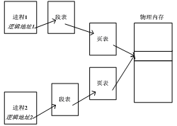

# 地址映射与共享
## 课程说明

本实验是 操作系统之内存管理 - 网易云课堂 的配套实验，推荐大家进行实验之前先学习相关课程：

- L20 内存使用与分段
- L21 内存分区与分页
- L22 段页结合的实际内存管理
- L23 请求调页内存换入
- L24 内存换出

> Tips：点击上方文字中的超链接或者输入 https://mooc.study.163.com/course/1000003007#/info 进入理论课程的学习。 如果网易云上的课程无法查看，也可以看 Bilibili 上的 操作系统哈尔滨工业大学李治军老师。

## 实验目的
- 深入理解操作系统的段、页式内存管理，深入理解段表、页表、逻辑地址、线性地址、物理地址等概念；
- 实践段、页式内存管理的地址映射过程；
- 编程实现段、页式内存管理上的内存共享，从而深入理解操作系统的内存管理。

## 实验内容
本次实验的基本内容是：

- 用 Bochs 调试工具跟踪 Linux 0.11 的地址翻译（地址映射）过程，了解 IA-32 和 Linux 0.11 的内存管理机制；
- 在 Ubuntu 上编写多进程的生产者—消费者程序，用共享内存做缓冲区；
- 在信号量实验的基础上，为 Linux 0.11 增加共享内存功能，并将生产者—消费者程序移植到 Linux 0.11。

### 跟踪地址翻译过程
首先以汇编级调试的方式启动 Bochs，引导 Linux 0.11，在 0.11 下编译和运行 test.c。它是一个无限循环的程序，永远不会主动退出。然后在调试器中通过查看各项系统参数，从逻辑地址、LDT 表、GDT 表、线性地址到页表，计算出变量 i 的物理地址。最后通过直接修改物理内存的方式让 test.c 退出运行。

test.c 的代码如下：
```c
#include <stdio.h>

int i = 0x12345678;
int main(void)
{
    printf("The logical/virtual address of i is 0x%08x", &i);
    fflush(stdout);
    while (i)
        ;
    return 0;
}
```
### 基于共享内存的生产者—消费者程序
本项实验在 Ubuntu 下完成，与信号量实验中的 pc.c 的功能要求基本一致，仅有两点不同：

- 不用文件做缓冲区，而是使用共享内存；
- 生产者和消费者分别是不同的程序。生产者是 `producer.c`，消费者是 `consumer.c`。两个程序都是单进程的，通过信号量和缓冲区进行通信。

Linux 下，可以通过 `shmget()` 和 `shmat()` 两个系统调用使用共享内存。

### 共享内存的实现
进程之间可以通过页共享进行通信，被共享的页叫做共享内存，结构如下图所示：


 
本部分实验内容是在 Linux 0.11 上实现上述页面共享，并将上一部分实现的 `producer.c` 和 `consumer.c` 移植过来，验证页面共享的有效性。

具体要求在 `mm/shm.c` 中实现 `shmget()` 和 `shmat()` 两个系统调用。它们能支持 `producer.c` 和 `consumer.c` 的运行即可，不需要完整地实现 POSIX 所规定的功能。
```c
shmget()
int shmget(key_t key, size_t size, int shmflg);
```

`shmget()` 会新建/打开一页内存，并返回该页共享内存的 `shmid`（该块共享内存在操作系统内部的 `id`）。

所有使用同一块共享内存的进程都要使用相同的 `key` 参数。

如果`key` 所对应的共享内存已经建立，则直接返回 `shmid`。如果 `size` 超过一页内存的大小，返回 `-1`，并置 `errno` 为 `EINVAL`。如果系统无空闲内存，返回 `-1`，并置 `errno` 为 `ENOMEM`。

`shmflg` 参数可忽略。
```c
shmat()
void *shmat(int shmid, const void *shmaddr, int shmflg);
```
`shmat()` 会将 shmid 指定的共享页面映射到当前进程的虚拟地址空间中，并将其首地址返回。

如果 `shmid` 非法，返回 `-1`，并置 `errno` 为 `EINVAL`。

`shmaddr` 和 `shmflg` 参数可忽略。
