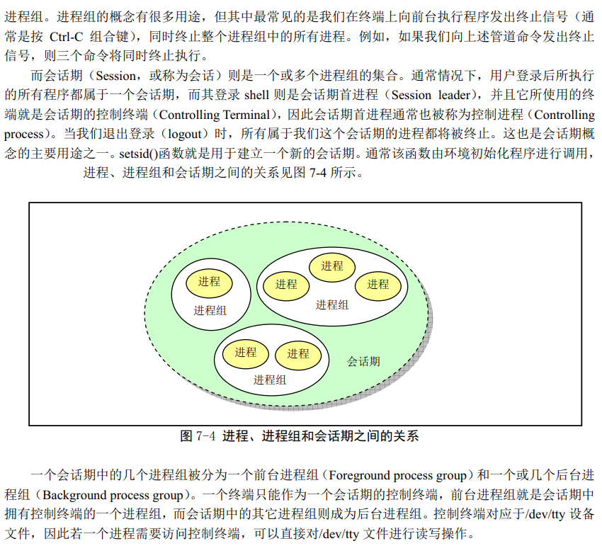

## 1. 会话及进程组概述




## 2. 相关源码实现
### 2.1 初始化 session 与 进程组
#### 2.1.1 初始化会话
在`kernel/sys.c`中：

```c
int sys_setsid(void)
{
	if (current->leader && !suser())
		return -EPERM;
	current->leader = 1;
	current->session = current->pgrp = current->pid;
	current->tty = -1;
	return current->pgrp;
}
```

### 2.1.2 初始化进程组
在`kernel/sys.c`中：

```c
/*
 * Linus 的这段注释很可爱... ^_^
 * 
 * This needs some heave checking ...
 * I just haven't get the stomach for it. I also don't fully
 * understand sessions/pgrp etc. Let somebody who does explain it.
 */
int sys_setpgid(int pid, int pgid)
{
	int i;

	// 如果 pid 为 0， 则说明是要给当前进程设置 pgid
	if (!pid)
		pid = current->pid;
		
	// 如果 pgid 为 0， 则说明 pgid 为当前进程的 pid
	if (!pgid)
		pgid = current->pid;
	
	//遍历找到 pid 对应的进程
	for (i=0 ; i<NR_TASKS ; i++)
		if (task[i] && task[i]->pid==pid) {
			// 如果那个进程为 leader，则其不能设置 pgid
			if (task[i]->leader)
				return -EPERM;
				
			// 如果那个进程 和 当前进程不属于同一个 session, 则不允许设置pid
			if (task[i]->session != current->session)
				return -EPERM;
			// 设置pid
			task[i]->pgrp = pgid;
			return 0;
		}
	return -ESRCH;
}
```

### 2.2 `kill` session 与 进程组

#### 2.2.1 `kill` session
在`kernel/exit.c`中：
```c
static void kill_session(void)
{
	struct task_struct **p = NR_TASKS + task;
	
	// 遍历所有进程，如果被便遍历到的进程的session和当前进程的session一致
	// 则修改信号，被修改信号后的进程当被调度到，然后进行信号处理时，其将被信号处理相关逻辑结束
	while (--p > &FIRST_TASK) {
		if (*p && (*p)->session == current->session)
			(*p)->signal |= 1<<(SIGHUP-1);
	}
}
```
#### 2.2.2 `kill` 进程组

在`kernel/exit.c`中：
```c
int sys_kill(int pid,int sig)
{
	struct task_struct **p = NR_TASKS + task;
	int err, retval = 0;

	// pid == 0，就给pgrp为当前进程pid的所有进程发送信号(当前进程的pgrp也为当前进程的pid)
	if (!pid) while (--p > &FIRST_TASK) {
		if (*p && (*p)->pgrp == current->pid) 
			if ((err=send_sig(sig,*p,1)))
				retval = err;
	} 
	// pid > 0, 就给pgrp为 pid 的所有进程发送信号
	else if (pid>0) while (--p > &FIRST_TASK) {
		if (*p && (*p)->pid == pid) 
			if ((err=send_sig(sig,*p,0)))
				retval = err;
	} 
	// pid == -1, 就给所有进程发送信号
	else if (pid == -1) while (--p > &FIRST_TASK) {
		if ((err = send_sig(sig,*p,0)))
			retval = err;
	} 
	// pid = 非-1的负数, 就给pgrp为 -pid 的所有进程发送信号
	else while (--p > &FIRST_TASK)
		if (*p && (*p)->pgrp == -pid)
			if ((err = send_sig(sig,*p,0)))
				retval = err;
	return retval;
}
```
