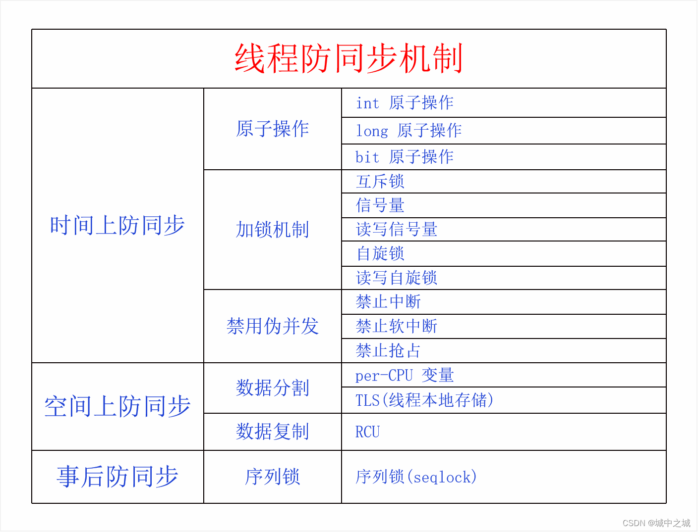

# [ futex ](https://developer.aliyun.com/article/app/6043?spm=a21i6v.25403440.0.0&navigationBar=)
# synchronized 原理
从功能和实现对其进行阐述。
### 功能
通过对对象加锁和解锁来实现多线程对代码块执行的互斥性，从而实现被包围的代码块的原子性。

### 实现
`synchronized` 的实现自上而下，总的来说分为 java 语言层面、java 字节码层面、JVM 实现(hotspot jdk 8)层面、glibc 层面、操作系统内核实现层面——futex系统调用 这五个层面，接下来我来依次对这五个层面的实现进行详细的阐述。

#### java 语言层面
设计`synchronized`关键字，用户可以直接使用`sycchronized`关键字来在代码块周围进行对象的加锁，解锁操作，要加锁的对象可以自定义，也可以使用默认的，`sycchronized`在成员方法上,默认使用当前对象，在静态方法上，默认使用当前类的Class对象。

#### java 字节码层面：
- 进入临界代码块：将要加锁的对象加入到当前栈帧中的操作数栈中，通过 monitor_enter 字节码指令进行加锁。
- 撤离临界代码块：使用 monitor_exit 解锁。 

#### JVM 实现(hotspot jdk 8)层面：
- 通过对象头的Mark Word字段来实现：
   - 偏向锁
      - 目的：
         - 减少轻量级锁CAS的消耗，但仅适合大多数情况下是同一个线程加锁的情况。
      - 实现
         - Mark Word 存储加锁线程ID。
         - 无需系统调用，同一个线程仅在第一次加锁时使用CAS来加锁，同一个线程后续再加锁时，仅仅检查对象头的线程ID是否是当前线程。是的话就直接加锁成功。不是的话分为两种情况：
            - 当前是否有竞争：
               - 是： 等待safe_point时膨胀到重量级锁：
               - 否：膨胀到轻量级锁：
            - 批量重偏向：
            - 批量撤销：

   - 轻量级锁(ReentrantLock也属于一种轻量级锁)
      - 目的：
         - 在虽然有多线程加锁，但是却很少发生多线程竞争的场景下，减少重量级锁系统调用产生的性能消耗。
      - 实现：
         - 在栈帧中创建空间存储当前的Mark Word(存储hash_code以及GC年龄等信息)，然后将Mark Word存储该部分地址，并使用基于CAS的自旋锁来进行修改，避免此时发生多线程竞争。
         - 当发生竞争时，升级到重量级锁。

   - 重量级锁
      - 重量级锁 会在 C++ 层面 创建一个 monitor 对象，该对象中，主要存在：wait_list,enter_list,owner三个属性：使用 glibc(标准C语言库) 里的pthread库里的`pthread_mutex_lock`方法。

#### glibc 层面：
glibc 里面的 `pthread_mutex_lock` 方法封装了系统调用`futex`， 其实现主要依靠`futex`系统调用。

#### 操作系统内核实现层面——futex系统调用：
futex系统调用，将 锁变量 以及 锁队列 都映射到用户空间，在没有竞争发生时，用户可以通过`基于CAS的自旋锁`在用户空间直接获取锁，而无需系统调用切换线程上下文，其仅在发生竞争需要修改线程状态时才进行系统调用。实际上通过系统调用在内核空间能做而用户空间不能做的事情，就是修改线程的运行状态。在`futex`以前，互斥锁的实现是通过操作系统的信号量相关的系统调用来实现的，我之前在Liuix 0.11 中实现过信号量的相关系统调用，不像futex 将 锁变量 以及 锁队列 都映射到用户空间，信号量的值被存储在内核态，并没有映射到用户空间，因此即使在没有竞争发生的情况下，对信号量值的每一次操作都要切入系统调用，这一部分其实是没有必要的。由此可见，相比信号量相关的系统调用实现，`futex`系统调用的实现极大地减少了系统调用的次数，从而减少了用户态到内核态切换的次数。

# ReentrantLock锁
从功能和实现两个层面进行介绍。

## 功能：
- 可重入锁
- 非公平锁
- 公平锁
- 可打断加锁
- 超时锁
- 尝试获取锁
- 多个条件变量(synchronized仅有一个条件变量，就是锁对象本身)

## 实现：
> [打通JAVA与内核系列之一ReentrantLock锁的实现原理](https://mp.weixin.qq.com/s?__biz=MzIzOTU0NTQ0MA==&mid=2247506325&idx=1&sn=54ba022fdaf9d35a10640d3f80997966&chksm=e92ae49ade5d6d8cd815c9ca2b50e20bd051f3358557f305cb70b9b00f4f7f661ee8d8515b7b&scene=178&cur_album_id=1391790902901014528#rd)

### JDK层
AQS，最终调用到`unsafe.park()`，且传入的对象(即：锁的对象)为 ReentrantLock中的`Sync`对象。用ReentrantLock创建的Condition调用await()方法时，调用的也是`unsafe.park()`，传入的对象(即：锁的对象)为Condition对象本身。

AQS 把本来在jvm层做的很多动作直接拿到了java语言层面，仅仅暴露了 park 和 unpark 两个native 方法，为什么说这块很巧妙呢，主要是因为实际上对于java线程来说，唯一在操作系统内核态要做的事情就是暂停与继续线程，而java无法直接调用系统调用，故这里调用了 native 方法，这个抽象十分合理。

### JVM层
C ++层面实现 Parker对象，主要有 _mutex、_counter、cond条件。
- 当调用park时，先尝试能否直接拿到“许可”，即_counter>0时，如果成功，则把_counter设置为0,并返回。
- 如果不成功，则把线程的状态设置成_thread_in_vm并且_thread_blocked。_thread_in_vm 表示线程当前在JVM中执行，_thread_blocked表示线程当前阻塞了。
- 拿到mutex之后，再次检查_counter是不是>0，如果是，则把_counter设置为0，unlock mutex并返回
- 如果_counter还是不大于0，则判断等待的时间是否等于0，然后调用相应的pthread_cond_wait系列函数进行等待，如果等待返回（即有人进行unpark，则pthread_cond_signal来通知），则把_counter设置为0，unlock mutex并返回。

### GLIBC 层
`pthread_cond_wait()` 方法封装了系统调用`futex`,通过`pthread_cond_wait()`的线程可以通过`pthread_cond_signal()`唤醒，`pthread_cond_signal()`时`unlock()`和`signal()`时调用的底层实现，其也是封装了系统调用`futex`。

无论是pthread_cond_wait还是pthread_cond_signal 都必须得先pthread_mutex_lock。如果没有这个保护，可能会产生race condition，漏掉信号。pthread_cond_wait()函数一进入wait状态就会自动release mutex。当其他线程通过pthread_cond_signal或pthread_cond_broadcast把该线程唤醒，使pthread_cond_wait()返回时，该线程又自动获得该mutex。
### 操作系统内核实现层面——futex系统调用：
futex系统调用，将 锁变量 以及 锁队列 都映射到用户空间，在没有竞争发生时，用户可以通过`基于CAS的自旋锁`在用户空间直接获取锁，而无需系统调用切换线程上下文，其仅在发生竞争需要修改线程状态时才进行系统调用。实际上通过系统调用在内核空间能做而用户空间不能做的事情，就是修改线程的运行状态。在`futex`以前，互斥锁的实现是通过操作系统的信号量相关的系统调用来实现的，我之前在Liuix 0.11 中实现过信号量的相关系统调用，不像futex 将 锁变量 以及 锁队列 都映射到用户空间，信号量的值被存储在内核态，并没有映射到用户空间，因此即使在没有竞争发生的情况下，对信号量值的每一次操作都要切入系统调用，这一部分其实是没有必要的。由此可见，相比信号量相关的系统调用实现，`futex`系统调用的实现极大地减少了系统调用的次数，从而减少了用户态到内核态切换的次数。

# volatile 原理
从功能和实现两个层面进行介绍。
## 功能
- 顺序性
- 可见性
## 实现：
> [volatile 原理深度解析](https://juejin.cn/post/7018357942403465246)  【文章中关于解析汇编 读取j 的说明是错误的，mov 指令不能说明 j 的读取是从主存中，而不是从缓存中，相反其就是从缓存中读取，从哪里读取并不能从汇编指令中看出，因为硬件处理这块对于汇编语言来说是透明的】

volatile的实现如下：

- 代码层面： volatile关键字
- 字节码层面：ACC_VOLATILE字段访问标识符
- JVM规范层面：JMM要求实现为内存屏障。
- （Hospot X86架构 实现）系统底层：
   
   - 读volatile基于c++的volatile关键字，每次从主存中读取。
   - 写volatile基于c++的volatile关键字和  lock 指令的内存屏障，每次将新值刷新到主存，同时其他cpu缓存的值失效。

C++的volatile禁止对这个变量相关的代码进行乱序优化（重排序），也就具有内存屏障的作用了，另外也可以手动插入内存屏障：_  asm _ _ volatile _  ( " " : : : "memory"  )。

# MESI
> [关于缓存一致性协议、MESI、StoreBuffer、InvalidateQueue、内存屏障、Lock指令和JMM的那点事](https://heapdump.cn/article/3971578)
#### 文章总结：
- 因为内存的速度和 CPU 匹配不上，所以在内存和 CPU 之间加了多级缓存。
- 单核 CPU 独享不会出现数据不一致的问题，但是多核情况下会有缓存一致性问题。
- 缓存一致性协议就是为了解决多组缓存导致的缓存一致性问题。
- 缓存一致性协议有两种实现方式，一个是基于目录的，一个是基于总线嗅探的。
- 基于目录的方式延迟高，但是占用总线流量小，适合 CPU 核数多的系统。
- 基于总线嗅探的方式延迟低，但是占用总线流量大，适合 CPU 核数小的系统。
- 常见的 MESI 协议就是基于总线嗅探实现的。
- MESI 解决了缓存一致性问题，但是还是不能将 CPU 性能压榨到极致。
- 为了进一步压榨 CPU，所以引入了 store buffer 和 invalidate queue。
- store buffer 和 invalidate queue 的引入导致不满足全局有序，所以需要有写屏障和读屏障。
- X86 架构下的读屏障指令是 lfenc，写屏障指令是 sfence，读写屏障指令是 mfence。
- lock 前缀指令直接锁缓存行，也能达到内存屏障的效果。
- x86 架构下，volatile 的底层实现就是 lock 前缀指令。
- JMM 是一个模型，是一个便于 Java 开发人员开发的抽象模型。
- 缓存性一致性协议是为了解决 CPU 多核系统下的数据一致性问题，是一个客观存在的东西，不需要去触发。
- JMM 和 缓存一致性协议没有一毛钱关系。
- JMM 和 MESI 没有一毛钱关系。
- JMM 中的读写屏障 和 CPU的读写屏障不一定一一对应。

我们这里不展开讨论细节，因为硬件的优化方式虽然思想与软件相同，但是实现却大不相同(且这类底层知识最好直接看论文，大多数人的描写都会多多少少有点问题)，故我们知道大概的思想和产生原因即可。如果对于细节感兴趣，可以阅读上面的文章。

# [悲观锁和乐观锁](https://mp.weixin.qq.com/s?__biz=MzkwMDE1MzkwNQ==&mid=2247496062&idx=1&sn=c04e0b83f38c45d06538ebac69529ee1&source=41#wechat_redirect)
# [自旋锁](https://www.cnblogs.com/cxuanBlog/p/11679883.html)
# [全面理解Java内存模型(JMM)及volatile关键字](https://blog.csdn.net/javazejian/article/details/72772461?spm=1001.2014.3001.5506)
# 其他
> - ### [伪共享与缓存行填充-1](https://blog.csdn.net/qq_27680317/article/details/78486220)
> - ### [伪共享与缓存行填充-2](https://blog.51cto.com/u_13561855/4035624)

