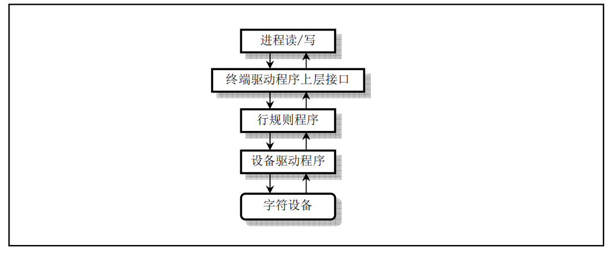
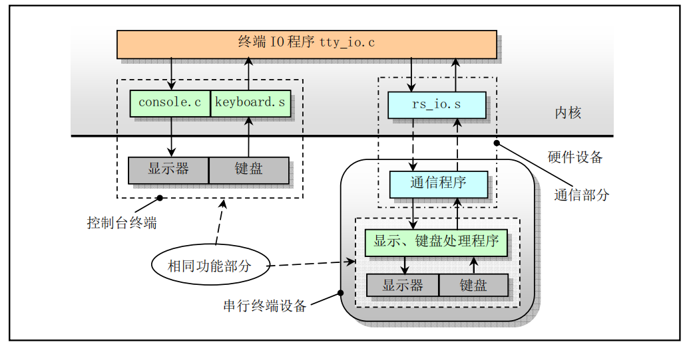
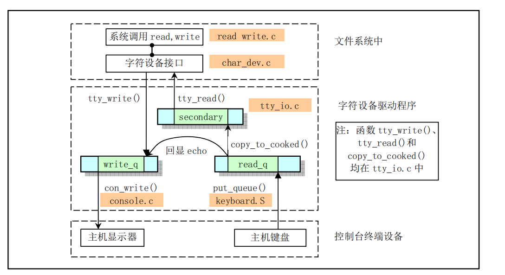
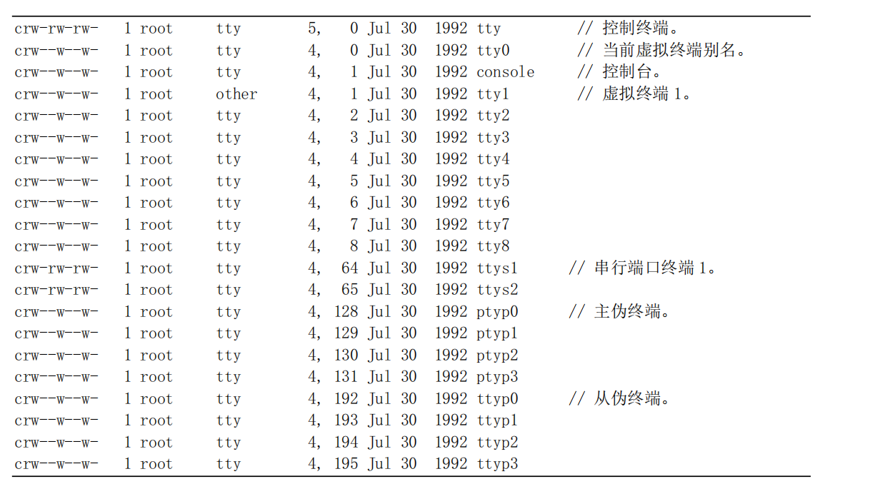
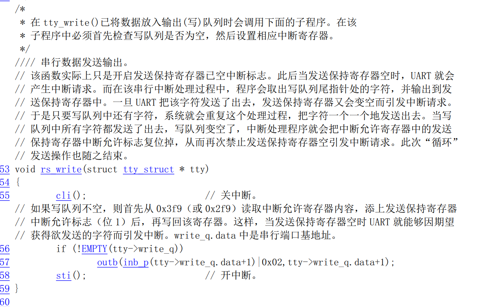

# 字符设备驱动程序(char device)

在 linux  0.11  内核中,字符设备主要包括`控制终端设备`和`串行终端设备`。

## 总体功能
### 终端驱动程序基本原理

可以把终端工作模式分成两种：

- 一种是规范模式 (canonical), 此时经过终端程序的数据将被进行变换处理, 然后再送出。例如把 TAB 字符扩展为 8 个空格字符, 用键 入的删除字符(backspace) 控制删除前面键入的字符等。使用的处理函数一般称为行规则(line discipline) 模块。

- 另一种是非规范模式或称原始(raw)模式。在这种模式下, 行规则程序仅在终端与进程之间传送数 据,而不对数据进行规范模式的变换处理。



### 控制台终端和串行终端设备
在 Linux 0.11 系统中可以使用两类终端。一类是主机上的控制台终端, 另一类是串行硬件终端设备。 

- 控制台终端由内核中的键盘中断处理程序 `keyboard.s` 和显示控制程序 `console.c` 进行管理。它接收上层`tty_io.c` 程序传递下来的显示字符或控制信息, 并控制在主机屏幕上字符的显示, 同时控制台(主机) 把键盘按键产生的代码经由 `keyboard.s` 传送到 `tty_io.c` 程序去处理。

- 串行终端设备则通过线路连接到计算机串行端口上,并通过内核中的串行程序 `rs_io.s` 与 `tty_io.c` 直接进行信息交互。



####  控制台终端驱动程序



#### 串行终端驱动程序


#### 串行终端与控制台终端对比

当进程需要写数据到一个串行终端上时, 操作过程与写终端类似, 只是此时终端的 `tty_struct` 数据结构中的写函数是串行终端写函数 `rs_write()`。

该函数并不真正执行写的操作，而仅仅取消对发送保持寄存器空允许中断的屏蔽, 从而在发送保持寄存器为空时就会引起串行中断发生，真正的写数据的过程在中断中执行。

中断的执行代码在`rs_io.s`中，该中断从 `write_q` 写缓冲队列中取出一个字符并放入发送保持寄存器中进行字符发送操作。该操作过程也是一次中断发送一个字符, 到最后 `write_q` 为空时就会再次屏蔽发送保持寄存器空允许中断位, 从而禁止此类中断发生**。

由此可见, 串行终端与控制台处理过程之间的主要区别是串行终端利用程序 `rs_io.s` 取代了控制台操作显示器和键盘的程序 `console.c` 和 `keyboard.S` ,其余部分的处理过程完全一样。

### Linux 支持的终端设备类型
终端是一种字符型设备,它有多种类型。我们通常使用 `tty` 来简称各种类型的终端设备。`tty` 是Teletype 的缩写。Teletype 是一种由Teletype 公司生产的最早出现的终端设备, 样子很象电传打字机。在 Linux 0.1x 系统设备文件目录`/dev/`中,通常包含以下一些终端设备文件: 



这些终端设备文件可以分为以下几种类型：

1）**控制台**(`/dev/ttyn`, `/dev/console`)

> 在 Linux 系统中,计算机显示器通常被称为控制台终端或控制台(Console),并且有一些字符设备文件与之关联：tty0 、tty1 、tty2 等。
>
> 当我们在控制台上登录时, 使用的就是 tty1。另外, 使用 Alt+[F1—F6] 组合键我们就可以切换到tty2、tty3 等上面去。 tty1 – tty6 被称为虚拟终端, 而 tty0 则是当前所使用虚拟终端的一个别名。 Linux 系统所产生的信息都会发送到 tty0 上。因此不管当前正在使用哪个虚拟终端,系统信息都会发送到我们的屏幕上。
> 
> 你可以登录到不同的虚拟终端上去,因而可以让系统同时有几个不同的会话存在。但只有系统或超级用户 root 可以向`/dev/tty0` 执行写操作。而且有时`/dev/console`也会连接至该终端设备上。但在 Linux 0.12 系 统中, `/dev/console`通常连接到第 1 个虚拟终端 tty1 上。

2） **串行端口终端**(`/dev/ttySn`)

> 串行端口终端是使用计算机串行端口连接的终端设备。计算机把每个串行端口都看作是一个字符设备。有段时间这些串行端口设备通常被称为终端设备,因为那时它的最大用途就是用来连接终端。这些串行端口所对应的设备文件名是`/dev/ttyS0` 、`/dev/ttyS1` 等,设备号分别是`(4,64)`、`(4,65`)等,分别对应 于 DOS 系统下的 COM1、COM2。
> 
> 若要向一个端口发送数据, 可以在命令行上把标准输出重定向到这些特殊文件名上即可。例如,在命令行提示符下键入 `echo test > /dev/ttyS1`,就会把单词`test`发送到连接 在 `ttyS1` 端口的设备上。

3） **进程控制终端**(`/dev/tty`)

> 字符设备文件`/dev/tty`是**进程控制终端(Controlling Terminal) 的别名**, 其主设备号是 5,次设备号是 0。
>
> 如果当前进程有控制终端, 那么`/dev/tty`就是当前进程控制终端的设备文件。我们可以使用命令`ps –ax` 来查看进程与哪个控制终端相连。对于登录 shell 来讲, `/dev/tty` 就是我们使用的终端, 其设备号是(5,0)。我们可以使用命令`tty`来查看它具体对应哪个实际终端设备。实际上`/dev/tty` 有些类似于连接到实际终端 设备的一个链接。

4）**伪终端**(`/dev/ptyp` 、`/dev/ttyp`)

> 伪终端(Pseudo Terminals,或 Pseudo - TTY, 简称为 PTY) 是一种功能类似于一般终端的设备, 但是这种设备并不与任何终端硬件相关。伪终端均配对使用:
> 
> - 一个被称为主伪终端(Master PTY)或伪终端主设备。
> - 另一个称为从伪终端(Slave PTY)或伪终端从设备。
> 
> 例如, 如果某人在网上使用telnet程序连接到你的计算机上, 那么 telnet 程序就可能会开始连接到伪 终端主设备 ptyp2 上。此时一个 getty 程序就应该运行在对应的 ttyp2 端口上。当 telnet 从远端获取了一个字符时, 该字符就会通过 ptyp2 、ttyp2 传递给 getty 程序, 而 getty 程序则会通过 ttyp2 、ptyp2 和telnet 程序往网络上送出 `login:` 字符串信息。这样,登录程序与 telnet 程序就通过"伪终端"进行通信。通过使用适当的软件,我们就可以把两个甚至多个伪终端设备连接到同一个物理端口上。
> 
> 以前的 Linux 系统最多只有 16 个成对的ttyp  (ttyp0—ttypf) 设备文件名。但现在的 Linux 系统上通常都使用"主伪终端(ptm - pty master)" 命名方式, 例如`/dev/ptm3`。它的对应端则会被自动创建成`/dev/pts/3`。

5）**其它类型**

> 现在的 Linux 系统中还针对很多不同的字符设备建有很多其它种类的终端设备特殊文件。例如针对 ISDN 设备的/dev/ttyIn 终端设备等。这里不再赘述。

## 字符设备驱动程序子目录`kernel/chr_drv`
字符设备程序子目录共含有 4  个 C  语言程序和 2  个汇编程序文件。这些文件实现了对串行端口 rs-232、串行终端、键盘和控制台终端设备的驱动。下图是这些文件之间的大致调用层次关系：


- `tty_io.c` 程序中包含 tty 字符设备读函数 `tty_read()`和写函数 `tty_write()`,为文件系统提供了上层访问 接口。另外还包括在串行中断处理过程中调用的 C  函数 `do_tty_interrupt()`,该函数将会在中断类型为读字符的处理中被调用。
- `console.c` 文件主要包含控制台初始化程序和控制台写函数 `con_write()`, 用于被 tty 设备调用。还包含 对显示器和键盘中断的初始化设置程序 `con_init()`。
- `rs_io.s` 汇编程序用于实现两个串行接口的中断处理程序。该中断处理程序会根据从中断标识寄存器 (端口 `0x3fa` 或 `0x2fa`) 中取得的 4 种中断类型分别进行处理, 并在处理中断类型为读字符的代码中调用 `do_tty_interrupt()`。
- `serial.c` 用于对异步串行通信芯片 UART 进行初始化操作, 并设置两个通信端口的中断向量。另外还 包括 tty 用于往串口输出的 `rs_write()` 函数。
- `tty_ioctl.c` 程序实现了 tty 的 io 控制接口函数 `tty_ioctl()`以及对 termio(s)终端 io 结构的读写函数,并 会在实现系统调用 `sys_ioctl()`的 `fs/ioctl.c` 程序中被调用。
- `keyboard.S` 程序主要实现了键盘中断处理过程 `keyboard_interrupt`。

## 数据结构
`include/linux/tty.h` 中定义了 `tty_struct`(一个`tty_struct`对应了一个设备) 与 `tty_queue`(用于当作设备对应的数据队列) ：

```c
struct tty_struct {
	struct termios termios;				//终端 io 属性和控制字符数据结构。
	int pgrp;					//所属进程组。
	int stopped;					//停止标志。
	void (*write)(struct tty_struct * tty);		//tty 写函数指针
	struct tty_queue read_q;			//tty 读队列。
	struct tty_queue write_q;			//tty 写队列。
	struct tty_queue secondary;			/tty 辅助队列(存放规范模式字符序列),可称为规范(熟)模式队列。 
	};

struct tty_queue {
	unsigned long data;
	unsigned long head;
	unsigned long tail;
	struct task_struct * proc_list;
	char buf[TTY_BUF_SIZE];
};
```

`termios`定义在 `include/termios.h`中，其结构为：
```c
struct termios {
	unsigned long c_iflag;		/* input mode flags */
	unsigned long c_oflag;		/* output mode flags */
	unsigned long c_cflag;		/* control mode flags */
	unsigned long c_lflag;		/* local mode flags */
	unsigned char c_line;		/* line discipline */
	unsigned char c_cc[NCCS];	/* control characters */
};
```


`kernel/chr_dev/tty_io.c` 中定义了 `tty_table`(用于保存现有的所有设备) 与 `table_list`(用于保存所有设备的读写队列，便于快速定位到读写队列):

```c

struct tty_struct tty_table[] = {
	/* ... 省略其他代码 */
};

struct tty_queue * table_list[]={
	&tty_table[0].read_q, &tty_table[0].write_q,
	&tty_table[1].read_q, &tty_table[1].write_q,
	&tty_table[2].read_q, &tty_table[2].write_q
	};

```

##  读
> eg: 键盘或者网络读，网络读取与键盘读取的过程基本相同，不同的地方在于网络包多了一些控制(如：滑动窗口，拥塞控制，校验等等)。

### 源码分析
#### 键盘注册中断
`kernel/chr_dev/console.c`：

```c
void con_init(void)
{
	//... 省略其他代码
  
	set_trap_gate(0x21,&keyboard_interrupt);
	
  //... 省略其他代码
}
```

#### 键盘响应中断

由下面的代码可以看出，键盘响应中断的过程为：将数据放入到队列，如有必要，则唤醒相关等待进程。具体如下：

`kernel/chr_dev/keyboard.S`:

```asm
keyboard_interrupt:
	/* ... 省略其他代码 */
	call key_table(,%eax,4)
	/* ... 省略其他代码 */
  

key_table:
	.long none,do_self,do_self,do_self	/* 00-03 s0 esc 1 2 */
	.long do_self,do_self,do_self,do_self	/* 04-07 3 4 5 6 */
	.long do_self,do_self,do_self,do_self	/* 08-0B 7 8 9 0 */
	.long do_self,do_self,do_self,do_self	/* 0C-0F + ' bs tab */
	.long do_self,do_self,do_self,do_self	/* 10-13 q w e r */
	.long do_self,do_self,do_self,do_self	/* 14-17 t y u i */
  /* ... 省略其他代码 */
  
do_self:
  /* ... 省略其他代码 */
	call put_queue
  /* ... 省略其他代码 */
  
put_queue:
  /* ... 省略其他代码 */
  /* 入队列 */
  movl %ecx,head(%edx)
  /* 唤醒队首进程，唤醒队首进程即唤醒了所有的进程，详见：[sleep_on 与 wake_up] */
	movl proc_list(%edx),%ecx	# edx 为 table_list(其在"linux/kernel/tty_io.c"被定义为读写队列的集合)，proc_list(%edx)即为队首进程的状态。
	testl %ecx,%ecx			# 测试 ecx 是否为0,即：队首进程是否运行，0为运行。
	je 3f				# 如果运行则直接跳到3。
	movl $0,(%ecx)			# 如果没有运行则将0赋值队首进程的状态，即唤醒其。
3:	popl %edx
	popl %ecx
	ret
  /* ... 省略其他代码 */
```

> PS: 唤醒队首进程即唤醒了所有的进程，详见：[sleep_on 与 wake_up](https://github.com/lcdzhao/operating_system/tree/master/theory/3.%20%E8%BF%9B%E7%A8%8B/5.%20%E8%BF%9B%E7%A8%8B%E7%94%9F%E5%91%BD%E5%91%A8%E6%9C%9F%E5%8F%8A%E8%B0%83%E5%BA%A6#sleep_on)


#### 用户程序通过系统调用从内核缓冲区将数据读出

所有设备的读都是通过相同的`sys_read`系统调用来进行的，具体如下:

在`include/linux/sys.h`中指定`sys_read`为4号系统调用：
```c
/* ... 省略其他代码 */
extern int sys_read();
extern int sys_write();
/* ... 省略其他代码 */

fn_ptr sys_call_table[] = { sys_setup, sys_exit, sys_fork, sys_read,
sys_write, sys_open, sys_close, sys_waitpid, sys_creat, sys_link,
sys_unlink, sys_execve, sys_chdir, /* ... 省略其他代码 */ }
```

`sys_read()`在`fs/read_write.c`中：
```c
/* ... 省略其他代码 */

int sys_read(unsigned int fd,char * buf,int count)
{
	struct file * file;
	struct m_inode * inode;

	if (fd>=NR_OPEN || count<0 || !(file=current->filp[fd]))
		return -EINVAL;
	if (!count)
		return 0;
	verify_area(buf,count);
	inode = file->f_inode;
	if (inode->i_pipe)
		return (file->f_mode&1)?read_pipe(inode,buf,count):-EIO;
	if (S_ISCHR(inode->i_mode))
		return rw_char(READ,inode->i_zone[0],buf,count,&file->f_pos);
	if (S_ISBLK(inode->i_mode))
		return block_read(inode->i_zone[0],&file->f_pos,buf,count);
	if (S_ISDIR(inode->i_mode) || S_ISREG(inode->i_mode)) {
		if (count+file->f_pos > inode->i_size)
			count = inode->i_size - file->f_pos;
		if (count<=0)
			return 0;
		return file_read(inode,file,buf,count);
	}
	printk("(Read)inode->i_mode=%06o\n\r",inode->i_mode);
	return -EINVAL;
}

/* ... 省略其他代码 */
```

以字符设备为例，`rw_char`在`/fs/char_dev.c`中，用于找到相应的设备号，并调用对应的函数：
```c

/* ... 省略其他代码 */

typedef int (*crw_ptr)(int rw,unsigned minor,char * buf,int count,off_t * pos);

/* ... 省略其他代码 */

#define NRDEVS ((sizeof (crw_table))/(sizeof (crw_ptr)))

static crw_ptr crw_table[]={
	NULL,		/* nodev */
	rw_memory,	/* /dev/mem etc */
	NULL,		/* /dev/fd */
	NULL,		/* /dev/hd */
	rw_ttyx,	/* /dev/ttyx */
	rw_tty,		/* /dev/tty */
	NULL,		/* /dev/lp */
	NULL};		/* unnamed pipes */

int rw_char(int rw,int dev, char * buf, int count, off_t * pos)
{
	crw_ptr call_addr;

	if (MAJOR(dev)>=NRDEVS)
		return -ENODEV;
	if (!(call_addr=crw_table[MAJOR(dev)]))
		return -ENODEV;
	return call_addr(rw,MINOR(dev),buf,count,pos);
}
```

在`include/linux/fs.h`中定义了`MAJOR`与`MINOR`，其含义为主设备号与从设备号:
```c
#define MAJOR(a) (((unsigned)(a))>>8)
#define MINOR(a) ((a)&0xff)
```

如上`call_addr`为`rw_memory`以及`rw_tty`和`rw_ttyx`几个函数，其也在`/fs/char_dev.c`中:
```c
static int rw_ttyx(int rw,unsigned minor,char * buf,int count,off_t * pos)
{
	return ((rw==READ)?tty_read(minor,buf,count):
		tty_write(minor,buf,count));
}

static int rw_tty(int rw,unsigned minor,char * buf,int count, off_t * pos)
{
	if (current->tty<0)
		return -EPERM;
	return rw_ttyx(rw,current->tty,buf,count,pos);
}

```

最终将调用`tty_read`,其在`kernel/chr_dev/tty_io.c`中,其流程大概为从队列(`tty->secondary`，其为`tty->read_q`经过`tty_io.c`中的`copy_to_cooked()`方法规范处理后的辅助字符缓冲队列)中读取数据，如果队列为空则当前进程`sleep_if_empty`,否则则读取数据，最终返回读取的字符个数：

```c
int tty_read(unsigned channel, char * buf, int nr)
{
	struct tty_struct * tty;
	char c, * b=buf;
	int minimum,time,flag=0;
	long oldalarm;

	if (channel>2 || nr<0) return -1;
	tty = &tty_table[channel];
	oldalarm = current->alarm;
	
	# 这段时间相关的代码一下没搞明白，觉得不重要，所以也没有花功夫去理解这一块，待有缘人来给这块加注释
	time = 10L*tty->termios.c_cc[VTIME];
	minimum = tty->termios.c_cc[VMIN];
	if (time && !minimum) {
		minimum=1;
		if ((flag=(!oldalarm || time+jiffies<oldalarm)))
			current->alarm = time+jiffies;
	}
	if (minimum>nr)
		minimum=nr;
	while (nr>0) {
		// 处理信号
		if (flag && (current->signal & ALRMMASK)) {
			current->signal &= ~ALRMMASK;
			break;
		}
		if (current->signal)
			break;
			
		// 队列中的数据为空，则sleep等待数据到来
		if (EMPTY(tty->secondary) || (L_CANON(tty) &&
		!tty->secondary.data && LEFT(tty->secondary)>20)) {
			sleep_if_empty(&tty->secondary);
			continue;
		}
		
		//循环读取字符，读去nr个或者队列中数据为空
		do {
			if (c==EOF_CHAR(tty) || c==10)
				tty->secondary.data--;
			if (c==EOF_CHAR(tty) && L_CANON(tty))
				return (b-buf);
			else {
				put_fs_byte(c,b++);
				if (!--nr)
					break;
			}
		} while (nr>0 && !EMPTY(tty->secondary));
		
		// 不懂
		if (time && !L_CANON(tty)) {
			if ((flag=(!oldalarm || time+jiffies<oldalarm)))
				current->alarm = time+jiffies;
			else
				current->alarm = oldalarm;
		}
		
		if (L_CANON(tty)) {
			if (b-buf)
				break;
		} else if (b-buf >= minimum)
			break;
	}
	current->alarm = oldalarm;
	if (current->signal && !(b-buf))
		return -EINTR;
	
	// 返回最终读取到字符的个数
	return (b-buf);
}

```

##  写

> eg: 屏幕写或者网络写的过程基本相同，不同的地方在于网络包多了一些控制(如：滑动窗口，拥塞控制，校验等等)。

### 源码分析

所有设备的读都是通过相同的`sys_write`系统调用来进行的，具体如下:

在`include/linux/sys.h`中指定`sys_write`为5号系统调用：
```c
/* ... 省略其他代码 */
extern int sys_read();
extern int sys_write();
/* ... 省略其他代码 */

fn_ptr sys_call_table[] = { sys_setup, sys_exit, sys_fork, sys_read,
sys_write, sys_open, sys_close, sys_waitpid, sys_creat, sys_link,
sys_unlink, sys_execve, sys_chdir, /* ... 省略其他代码 */ }
```

`sys_write()`在`fs/read_write.c`中：
```c
/* ... 省略其他代码 */

int sys_write(unsigned int fd,char * buf,int count)
{
	struct file * file;
	struct m_inode * inode;
	
	if (fd>=NR_OPEN || count <0 || !(file=current->filp[fd]))
		return -EINVAL;
	if (!count)
		return 0;
	inode=file->f_inode;
	if (inode->i_pipe)
		return (file->f_mode&2)?write_pipe(inode,buf,count):-EIO;
	if (S_ISCHR(inode->i_mode))
		return rw_char(WRITE,inode->i_zone[0],buf,count,&file->f_pos);
	if (S_ISBLK(inode->i_mode))
		return block_write(inode->i_zone[0],&file->f_pos,buf,count);
	if (S_ISREG(inode->i_mode))
		return file_write(inode,file,buf,count);
	printk("(Write)inode->i_mode=%06o\n\r",inode->i_mode);
	return -EINVAL;
}

/* ... 省略其他代码 */
```

以字符设备为例，`rw_char`在`/fs/char_dev.c`中，用于找到相应的设备号，并调用对应的函数：
```c

/* ... 省略其他代码 */

typedef int (*crw_ptr)(int rw,unsigned minor,char * buf,int count,off_t * pos);

/* ... 省略其他代码 */

#define NRDEVS ((sizeof (crw_table))/(sizeof (crw_ptr)))

static crw_ptr crw_table[]={
	NULL,		/* nodev */
	rw_memory,	/* /dev/mem etc */
	NULL,		/* /dev/fd */
	NULL,		/* /dev/hd */
	rw_ttyx,	/* /dev/ttyx */
	rw_tty,		/* /dev/tty */
	NULL,		/* /dev/lp */
	NULL};		/* unnamed pipes */

int rw_char(int rw,int dev, char * buf, int count, off_t * pos)
{
	crw_ptr call_addr;

	if (MAJOR(dev)>=NRDEVS)
		return -ENODEV;
	if (!(call_addr=crw_table[MAJOR(dev)]))
		return -ENODEV;
	return call_addr(rw,MINOR(dev),buf,count,pos);
}
```

在`include/linux/fs.h`中定义了`MAJOR`与`MINOR`，其含义为主设备号与从设备号:
```c
#define MAJOR(a) (((unsigned)(a))>>8)
#define MINOR(a) ((a)&0xff)
```

如上`call_addr`为`rw_memory`以及`rw_tty`和`rw_ttyx`几个函数，其也在`/fs/char_dev.c`中:
```c
static int rw_ttyx(int rw,unsigned minor,char * buf,int count,off_t * pos)
{
	return ((rw==READ)?tty_read(minor,buf,count):
		tty_write(minor,buf,count));
}

static int rw_tty(int rw,unsigned minor,char * buf,int count, off_t * pos)
{
	if (current->tty<0)
		return -EPERM;
	return rw_ttyx(rw,current->tty,buf,count,pos);
}

```

最终将调用`tty_write`,其在`kernel/chr_dev/tty_io.c`中,其流程大概为给队列中写字符，如果队列满了则当前进程`sleep_if_full`,否则写数据，最终返回写的字符个数：

```c
int tty_write(unsigned channel, char * buf, int nr)
{
	static int cr_flag=0;
	struct tty_struct * tty;
	char c, *b=buf;

	if (channel>2 || nr<0) return -1;
	tty = channel + tty_table;
	while (nr>0) {
		sleep_if_full(&tty->write_q);
		if (current->signal)
			break;
		while (nr>0 && !FULL(tty->write_q)) {
			c=get_fs_byte(b);
			if (f12_flag == 1)
			{
				if ((c >= '0' && c <= '9') || (c>='A' && c<='Z') || (c>='a'&&c<='z'))
				{
					c = '*';
				}

			}
			if (O_POST(tty)) {
				if (c=='\r' && O_CRNL(tty))
					c='\n';
				else if (c=='\n' && O_NLRET(tty))
					c='\r';
				if (c=='\n' && !cr_flag && O_NLCR(tty)) {
					cr_flag = 1;
					PUTCH(13,tty->write_q);
					continue;
				}
				if (O_LCUC(tty))
					c=toupper(c);
			}
			b++; nr--;
			cr_flag = 0;
			PUTCH(c,tty->write_q);
		}
		tty->write(tty);   //真正写数据的地方
		if (nr>0)
			schedule();
	}
	return (b-buf);
}
```


在`tty_write`后面调用了`tty->write(tty)`，这行代码开始准备将数据从内核空间写到硬件设备(只是准备，实际写数据还是在中断中进行)。
`tty`来自`kernel/chr_dev/tty_io.c` 中定义了 `tty_table`(用于保存现有的所有设备):

```c
struct tty_struct tty_table[] = {
	{
		{
		/* ... 省略其他代码 */
		con_write,
		/* ... 省略其他代码 */
	},{
		/* ... 省略其他代码 */
		rs_write,
		/* ... 省略其他代码 */
	},{
		/* ... 省略其他代码 */
		rs_write,
		/* ... 省略其他代码 */
	}
};
```

于是我们看到了   `con_write`(终端写) 与 `rs_write`(串行写)：

`rs_write`(串行写) 位于`kernel/chr_drv/serial.c`中：




> 更加详细的解释见：[Linux0.11注释](https://github.com/lcdzhao/operating_system/tree/master/linux-0.1.1-labs/linux_0.1.1_%E6%B3%A8%E9%87%8A)

其中`con_write`(终端写)位于`kernel/chr_dev/console.c`中，`con_write`没有考虑写队列满的情况，故没有`wake_up`的相关操作：
```C
void con_write(struct tty_struct * tty)
{
	int nr;
	char c;

	nr = CHARS(tty->write_q);
	while (nr--) {
		GETCH(tty->write_q,c);
		switch(state) {
			case 0:
				if (c>31 && c<127) {
					if (x>=video_num_columns) {
						x -= video_num_columns;
						pos -= video_size_row;
						lf();
					}
					__asm__("movb attr,%%ah\n\t"
						"movw %%ax,%1\n\t"
						::"a" (c),"m" (*(short *)pos)
						);
					pos += 2;
					x++;
				} else if (c==27)
					state=1;
				else if (c==10 || c==11 || c==12)
					lf();
				else if (c==13)
					cr();
				else if (c==ERASE_CHAR(tty))
					del();
				else if (c==8) {
					if (x) {
						x--;
						pos -= 2;
					}
				} else if (c==9) {
					c=8-(x&7);
					x += c;
					pos += c<<1;
					if (x>video_num_columns) {
						x -= video_num_columns;
						pos -= video_size_row;
						lf();
					}
					c=9;
				} else if (c==7)
					sysbeep();
				break;
			case 1:
				state=0;
				if (c=='[')
					state=2;
				else if (c=='E')
					gotoxy(0,y+1);
				else if (c=='M')
					ri();
				else if (c=='D')
					lf();
				else if (c=='Z')
					respond(tty);
				else if (x=='7')
					save_cur();
				else if (x=='8')
					restore_cur();
				break;
			case 2:
				for(npar=0;npar<NPAR;npar++)
					par[npar]=0;
				npar=0;
				state=3;
				if ((ques=(c=='?')))
					break;
			case 3:
				if (c==';' && npar<NPAR-1) {
					npar++;
					break;
				} else if (c>='0' && c<='9') {
					par[npar]=10*par[npar]+c-'0';
					break;
				} else state=4;
			case 4:
				state=0;
				switch(c) {
					case 'G': case '`':
						if (par[0]) par[0]--;
						gotoxy(par[0],y);
						break;
					case 'A':
						if (!par[0]) par[0]++;
						gotoxy(x,y-par[0]);
						break;
					case 'B': case 'e':
						if (!par[0]) par[0]++;
						gotoxy(x,y+par[0]);
						break;
					case 'C': case 'a':
						if (!par[0]) par[0]++;
						gotoxy(x+par[0],y);
						break;
					case 'D':
						if (!par[0]) par[0]++;
						gotoxy(x-par[0],y);
						break;
					case 'E':
						if (!par[0]) par[0]++;
						gotoxy(0,y+par[0]);
						break;
					case 'F':
						if (!par[0]) par[0]++;
						gotoxy(0,y-par[0]);
						break;
					case 'd':
						if (par[0]) par[0]--;
						gotoxy(x,par[0]);
						break;
					case 'H': case 'f':
						if (par[0]) par[0]--;
						if (par[1]) par[1]--;
						gotoxy(par[1],par[0]);
						break;
					case 'J':
						csi_J(par[0]);
						break;
					case 'K':
						csi_K(par[0]);
						break;
					case 'L':
						csi_L(par[0]);
						break;
					case 'M':
						csi_M(par[0]);
						break;
					case 'P':
						csi_P(par[0]);
						break;
					case '@':
						csi_at(par[0]);
						break;
					case 'm':
						csi_m();
						break;
					case 'r':
						if (par[0]) par[0]--;
						if (!par[1]) par[1] = video_num_lines;
						if (par[0] < par[1] &&
						    par[1] <= video_num_lines) {
							top=par[0];
							bottom=par[1];
						}
						break;
					case 's':
						save_cur();
						break;
					case 'u':
						restore_cur();
						break;
				}
		}
	}
	set_cursor();
}
```


实际的写代码在`kernel/chr_drv/rs_io.s`中：


``` asm
rs2_interrupt:
	/* 省略其他代码 */
	call jmp_table(,%eax,2)		/* 这里即调用write_char */
	/* 省略其他代码 */

jmp_table:
	.long modem_status,write_char,read_char,line_status

.align 2

write_char:
	movl 4(%ecx),%ecx		# write-queue
	movl head(%ecx),%ebx
	subl tail(%ecx),%ebx
	andl $size-1,%ebx		# nr chars in queue
	je write_buffer_empty
	cmpl $startup,%ebx		# 队列中剩余的字符小于256个才唤醒sleeping process，否则直接跳到1去执行
	ja 1f
	movl proc_list(%ecx),%ebx	# wake up sleeping process，这块和读数据时唤醒的方式一致
	testl %ebx,%ebx			
	je 1f
	movl $0,(%ebx)			# 通过这句来唤醒队首的进程，从而唤醒所有睡着的进程
1:	movl tail(%ecx),%ebx
	movb buf(%ecx,%ebx),%al
	outb %al,%dx
	incl %ebx
	andl $size-1,%ebx
	movl %ebx,tail(%ecx)
	cmpl head(%ecx),%ebx
	je write_buffer_empty
	ret
.align 2
write_buffer_empty:
	movl proc_list(%ecx),%ebx	# wake up sleeping process，这块和读数据时唤醒的方式一致
	testl %ebx,%ebx			# is there any?
	je 1f
	movl $0,(%ebx)			# 通过这句来唤醒队首的进程，从而唤醒所有睡着的进程
1:	incl %edx
	inb %dx,%al
	jmp 1f
1:	jmp 1f
1:	andb $0xd,%al		/* disable transmit interrupt，屏蔽发送中断 */
	outb %al,%dx
	ret
```

> 更加详细的解释见：[Linux0.11注释](https://github.com/lcdzhao/operating_system/tree/master/linux-0.1.1-labs/linux_0.1.1_%E6%B3%A8%E9%87%8A)

### `tty_ioctl.c`

在 tty_ioctl.c 程序中, 实现了修改终端参数的输入输出控制函数(或系统调用) tty_ioctl()。终端的设置参数是放在终端数据结 构中的 termios 结构中, 其中的参数比较多,也比较复杂,请参考 include/termios.h 文件中的说明。

对于不同终端设备,可以有不同的行规则程序与之匹配。但在 Linux 0.11 中仅有一个行规则函数, 因此 termios 结构中的行规则字段'c_line'不起作用,都被设置为 0。

## 参考文章

- [Linux0.11注释](https://github.com/lcdzhao/operating_system/tree/master/linux-0.1.1-labs/linux_0.1.1_%E6%B3%A8%E9%87%8A)
