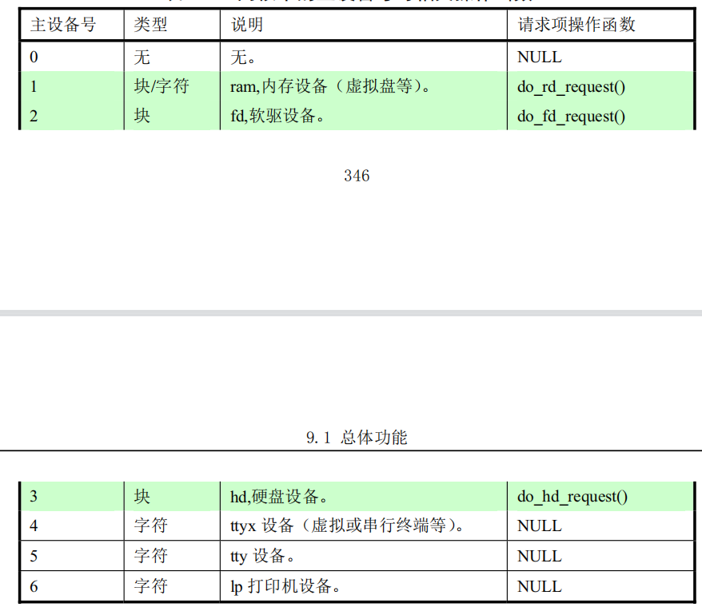

# 块设备驱动程序(block driver)

> 块设备是一种可以**以固定大小的数据块为单位进行寻址和访问的设备**,例如硬盘设备和软盘设备。Linux  0.11 内核主要支持硬盘、软盘和内存虚拟盘三种块设备。

## 总体功能

对硬盘和软盘块设备上数据的读写操作是通过中断处理程序进行的。内核每次读写的数据量以一个 逻辑块(1024 字节)为单位,而块设备控制器则是以扇区(512 字节)为单位。在处理过程中,使用了读写请求项等待队列来顺序缓冲一次读写多个逻辑块的操作。

当程序需要读取硬盘上的一个逻辑块时,就会向缓冲区管理程序提出申请,而**程序的进程则进入睡眠等待状态**。缓冲区管理程序**首先在缓冲区中寻找以前是否已经读取过这块数据**。**如果缓冲区中已经有了,就直接将对应的缓冲区块头指针返回给程序并唤醒该程序进程**。**若缓冲区中还不存在所要求的数据块,则缓冲管理程序就会调用本章中的低级块读写函数 `ll_rw_block()`,向相应的块设备驱动程序发出一个读数据块的操作请求**。该函数会为此创建一个请求结构项,并插入请求队列中。为了提供读写磁盘的效率,减小磁头移动的距离,在插入请求项时使用了**电梯移动算法**。

**此时,若对应块设备的请求项队列为空,则表明此刻该块设备不忙。于是内核就会立刻向该块设备 的控制器发出读数据命令。当块设备的控制器将数据读入到指定的缓冲块中后, 就会发出中断请求信号, 并调用相应的读命令后处理函数,处理继续读扇区操作或者结束本次请求项的过程。例如对相应块设备进行关闭操作和设置该缓冲块数据已经更新标志,最后唤醒等待该块数据的进程**。

### 块设备请求项和请求队列
根据上面描述,我们知道低级读写函数 `ll_rw_block()`是通过**请求项**来与各种块设备建立联系并发出 读写请求。对于各种块设备, 内核使用了一张块设备表 `blk_dev[]`来进行管理。每种块设备都在块设备表 中占有一项。块设备表中每个块设备项的结构为(摘自 `kernel/blk_drv/blk.h`)。
```c
struct blk_dev_struct {
	void (*request_fn)(void);             //请求项操作的函数指针
	struct request * current_request;     //当前请求项指针。
};

extern struct blk_dev_struct blk_dev[NR_BLK_DEV];   //块设备表(数组)(NR_BLK_DEV=7)。
```

其中:

- **第一个字段是一个函数指针**,用于操作相应块设备的请求项。例如,对于硬盘驱动程序,它是 `do_hd_request()`,而对于软盘设备,它就是 `do_floppy_request()`。
- **第二个字段是当前请求项结构指针**,用于指明本块设备目前正在处理的请求项,初始化时都被置成 `NULL`。

块设备表将在内核初始化时, 在 `init/main.c` 程序调用各设备的初始化函数时被设置。为了便于扩展, Linus 把块设备表建成了一个以主设备号为索引的数组。在 Linux 0.11 中, 主设备号有 7 种, 见下表。其中, 主设备号 1、2 和 3 分别对应块设备: 虚拟盘、软盘和硬盘。在块设备数组中其他各项都被默认地置成 `NULL`。




## 与文件系统的关系

## 块设备驱动程序子目录 `kernel/blk_drv`

通常情况下,用户是通过文件系统来访问设备的,因此设备驱动程序为文件系统实现了调用接口。 在使用块设备时,由于其数据吞吐量大,为了能够高效率地使用块设备上的数据,在用户进程与块设备 之间使用了高速缓冲机制。在访问块设备上的数据时,系统首先以数据块的形式把块设备上的数据读入 到高速缓冲区中,然后再提供给用户。 `blk_drv` 子目录共包含 4 个 c 文件和 1 个头文件。头文件 `blk.h` 由 于是块设备程序专用的,所以与 C 文件放在一起。这几个文件之间的大致关系,见下图所示。


`blk.h` 中定义了 3 个 C 程序中共用的块设备结构和数据块请求结构。`hd.c` 程序主要实现对硬盘数据块 进行读/写的底层驱动函数, 主要是 `do_hd__request()`函数﹔ `floppy.c` 程序中主要实现了对软盘数据块的读 / 写驱动函数,主要是 `do_fd_request()` 函数。 `ll_rw_blk.c`  中程序实现了低层块设备数据读/ 写函数 `ll_rw_block()`, 内核中所有其他程序都是通过该函数对块设备进行数据读写操作。你将看到该函数在许多 访问块设备数据的地方被调用,尤其是在高速缓冲区处理文件 `fs/buffer.c` 中。


## 这块根据 Linux 0.11 的第9章 块驱动写
