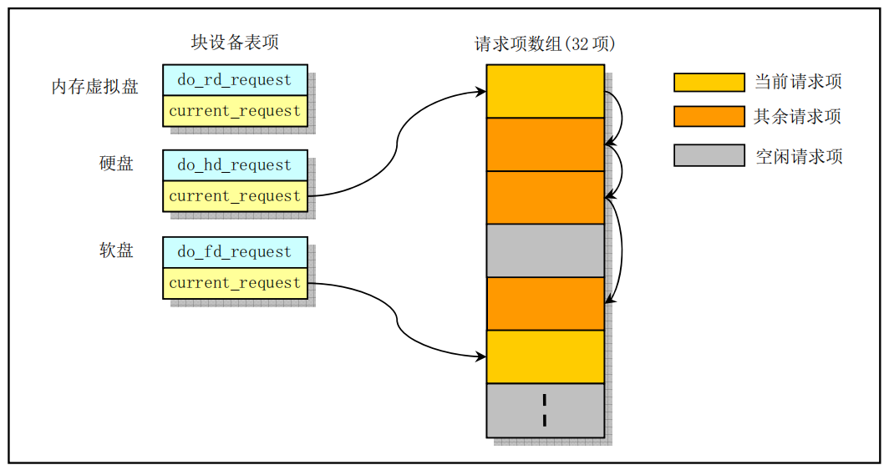

# 块设备驱动程序(block driver)

> 块设备是一种可以**以固定大小的数据块为单位进行寻址和访问的设备**,例如硬盘设备和软盘设备。Linux  0.11 内核主要支持硬盘、软盘和内存虚拟盘三种块设备。

## 总体功能

对硬盘和软盘块设备上数据的读写操作是通过中断处理程序进行的。内核每次读写的数据量以一个 逻辑块(1024 字节)为单位,而块设备控制器则是以扇区(512 字节)为单位。在处理过程中,使用了读写请求项等待队列来顺序缓冲一次读写多个逻辑块的操作。

当程序需要读取硬盘上的一个逻辑块时,就会向缓冲区管理程序提出申请,而**程序的进程则进入睡眠等待状态**。缓冲区管理程序**首先在缓冲区中寻找以前是否已经读取过这块数据**。**如果缓冲区中已经有了,就直接将对应的缓冲区块头指针返回给程序并唤醒该程序进程**。**若缓冲区中还不存在所要求的数据块,则缓冲管理程序就会调用本章中的低级块读写函数 `ll_rw_block()`,向相应的块设备驱动程序发出一个读数据块的操作请求**。该函数会为此创建一个请求结构项,并插入请求队列中。为了提供读写磁盘的效率,减小磁头移动的距离,在插入请求项时使用了**电梯移动算法**。

**此时,若对应块设备的请求项队列为空,则表明此刻该块设备不忙。于是内核就会立刻向该块设备 的控制器发出读数据命令。当块设备的控制器将数据读入到指定的缓冲块中后, 就会发出中断请求信号, 并调用相应的读命令后处理函数,处理继续读扇区操作或者结束本次请求项的过程。例如对相应块设备进行关闭操作和设置该缓冲块数据已经更新标志,最后唤醒等待该块数据的进程**。

### 块设备请求项和请求队列
根据上面描述,我们知道低级读写函数 `ll_rw_block()`是通过**请求项**来与各种块设备建立联系并发出 读写请求。对于各种块设备, 内核使用了一张块设备表 `blk_dev[]`来进行管理。每种块设备都在块设备表 中占有一项。块设备表中每个块设备项的结构为(摘自 `kernel/blk_drv/blk.h`)。
```c
struct blk_dev_struct {
	void (*request_fn)(void);             //请求项操作的函数指针
	struct request * current_request;     //当前请求项指针。
};

extern struct blk_dev_struct blk_dev[NR_BLK_DEV];   //块设备表(数组)(NR_BLK_DEV=7)。
```

其中:

- **第一个字段是一个函数指针**,用于操作相应块设备的请求项。例如,对于硬盘驱动程序,它是 `do_hd_request()`,而对于软盘设备,它就是 `do_floppy_request()`。
- **第二个字段是当前请求项结构指针**,用于指明本块设备目前正在处理的请求项,初始化时都被置成 `NULL`。

块设备表将在内核初始化时, 在 `init/main.c` 程序调用各设备的初始化函数时被设置。为了便于扩展, Linus 把块设备表建成了一个以主设备号为索引的数组。在 Linux 0.11 中, 主设备号有 7 种, 见下表。其中, 主设备号 1、2 和 3 分别对应块设备: 虚拟盘、软盘和硬盘。在块设备数组中其他各项都被默认地置成 `NULL`。


当内核发出一个块设备读写或其他操作请求时,`ll_rw_block()`函数即会根据其参数中指明的操作命令 和数据缓冲块头中的设备号, 利用对应的请求项操作函数 `do_XX_request()`建立一个块设备请求项(函数名中的'XX'可以是'rd' 、'fd'或'hd', 分别代表内存、软盘和硬盘块设备), 并利用电梯算法插入到请求项队列中。请求项队列由请求项数组中的项构成,共有 32 项, 每个请求项的数据结构如下所示:
```c
struct request {
	int dev;				//使用的设备号(若为-1, 表示该项空闲)
	int cmd;				//命令(READ 或 WRITE)。
	int errors;				//操作时产生的错误次数
	unsigned long sector;			//起始扇区。(1 块=2 扇区)
	unsigned long nr_sectors;		//读/写扇区数。
	char * buffer;				//数据缓冲区。
	struct task_struct * waiting;		//等待操作执行完成的任务
	struct buffer_head * bh;		//缓冲区头指针(inblucd/linux/fs.h,68)。 
	struct request * next;			//指向下一请求项。
};

extern struct request request[NR_REQUEST];	//请求项数组(NR_REQUEST=32)
```
每个块设备的当前请求指针与请求项数组中该设备的请求项链表共同构成了该设备的请求队列。项与项之间利用字段 `next` 指针形成链表。因此块设备项和相关的请求队列形成如下图所示结构。请求项采用数组加链表结构的主要原因是为了满足两个目的：

- 一是利用请求项的数组结构在搜索空闲请求块时 可以进行循环操作,搜索访问时间复杂度为常数,因此程序可以编制得很简洁﹔
- 二是为满足电梯算法(Elevator Algorithm) 插入请求项操作, 因此也需要采用链表结构。
 
下图中示出了硬盘设备当前具有 4 个请求项,软盘设备具有 1 个请求项,而虚拟盘设备目前暂时没有读写请求项。



对于一个当前空闲的块设备,当 `ll_rw_block()` 函数为其建立第一个请求项时,会让该设备的当前请求项指针 `current_request` 直接指向刚建立的请求项,并且立刻调用对应设备的请求项操作函数开始执行 块设备读写操作。当一个块设备已经有几个请求项组成的链表存在, `ll_rw_block()`就会利用电梯算法, 根据磁头移动距离最小原则,把新建的请求项插入到链表适当的位置处。

另外,为满足读操作的优先权,在为建立新的请求项而搜索请求项数组时,把建立写操作时的空闲 项搜索范围限制在整个请求项数组的前 2/3 范围内, 而剩下的 1/3 请求项专门给读操作建立请求项使用。

### 块设备访问调度处理
相对于内存来说,访问硬盘和软盘等块设备中的数据是比较耗时并且影响系统性能的操作。由于硬 盘(或软盘)磁头寻道操作(即把读写磁头从一个磁道移动到另一个指定磁道上)需要花费很长时间, 因此我们有必要在向硬盘控制器发送访问操作命令之前对读/写磁盘扇区数据的顺序进行排序, 即对请求 项链表中各请求项的顺序进行排序,使得所有请求项访问的磁盘扇区数据块都尽量依次顺序进行操作。 在 Linux 0.1x 内核中,请求项排序操作使用的是电梯算法。其操作原理类似于电梯的运行轨迹(向一个方向移动),直到该方向上最后一个"请求"停止层为止。然后执行反方向移动。对于磁盘来讲就是磁头一直向盘片圆心方向移动,或者反之向盘片边缘移动,参见硬盘结构示意图。

因此,内核并非按照接收到请求项的顺序直接发送给块设备进行处理,而是需要对请求项的顺序进 行处理。我们通常把相关的处理程序称为 I/O 调度程序。Linux 0. 1x 中的 I/O 调度程序仅对请求项进行了 排序处理,而当前流行的 Linux 内核(例如 2.6.x )的 I/O 调度程序中还包含对访问相邻磁盘扇区的两个 或多个请求项的合并处理。

### 块设备操作方式
在系统(内核)与硬盘进行 IO  操作时,需要考虑三个对象之间的交互作用。它们是系统、控制器和驱动器(例如硬盘或软盘驱动器), 见下图所示。系统可以直接向控制器发送命令或等待控制器发出中断请求﹔控制器在接收到命令后就会控制驱动器的操作, 读/写数据或者进行其他操作。因此我们可以把这里控制器发出的中断信号看作是这三者之间的同步操作信号,所经历的操作步骤为：

- 首先系统指明控制器在执行命令结束而引发的中断过程中应该调用的 C 函数, 然后向块设备控制器发送读、写、复位或其他操作命令﹔
- 当控制器完成了指定的命令,会发出中断请求信号,引发系统执行块设备的中断处理过程,并在其中调用指定的 C 函数对读/写或其他命令进行命令结束后的处理工作。


#### 写盘操作

- STEP 1：系统需要在发出了写命令后(使用 `hd_out()`)等待控制器给予允许向控制器写数据的响应, 也即需要查询等待控制器状态寄存器的数据请求服务标志 `DRQ` 置位。一旦 `DRQ` 置位, 系统就可以向控制器缓冲区发送一个扇区的数据。

- STEP 2：当控制器把数据全部写入驱动器(或发生错误)以后,还会产生中断请求信号,从而在中断处理过程中执行前面预设置的 C 函数(`write_intr()`)。这个函数会查询是否还有数据要写。如果有,系统就再把一个扇区的数据传到控制器缓冲区中,然后再次等待控制器把数据写入驱动器后引发的中断,一直这样重复执行。

- STEP 3：如果此时所有数据都已经写入驱动器, 则该 C 函数就执行本次写盘结束后的处理工作 ：唤醒等待该请求项有关数据的相关进程、唤醒等待请求项的进程、释放当前请求项并从链表中删除该请求项 以及释放锁定的相关缓冲区。

- STEP 4：最后再调用请求项操作函数去执行下一个读/写盘请求项(若还有的话)。

#### 读盘操作

- STEP 1：系统在向控制器发送出包括需要读的扇区开始位置、扇区数量等信息的命令后,就等待控制器产生中断信号。

- STEP 2：当控制器按照读命令的要求,把指定的一扇区数据从驱动器传到了自己的缓冲区之后就会发出中断请求。从而会执行到前面为读盘操作预设置的 C 函数(`read_intr()`)。该函数首先把控制器缓冲区中一个扇区的数据放到系统的缓冲区中,调整系统缓冲区中当前写入位置,然后递减需读的扇区数量。若还有数据要读(递减结果值不为 0), 则继续等待控制器发出下一个中断信号。

- STEP 3：若此时所有要求的扇区都已经读到系统缓冲区中,就执行与上面写盘操作一样的结束处理工作。

#### 虚拟盘设备
对于虚拟盘设备,由于它的读写操作不牵涉到与外部设备之间的同步操作,因此没有上述的中断处 理过程。当前请求项对虚拟设备的读写操作完全在 do_rd_request()中实现。

#### 注意
需要提醒的一件事是：在向硬盘或软盘控制器发送了读/写或其他命令后, 发送命令函数并不会等待所发命令的执行过程,而是立刻返回调用它的程序中,并最终返回到调用块设备读写函数 `ll_rw_block()` 的其他函数中去等待块设备 IO  的完成。例如高速缓冲区管理程序 `fs/buffer.c`  中的读块函数 `bread()`  (第 267 行), 在调用了 `ll_rw_block()`之后, 就调用等待函数 `wait_on_buffer()`让执行当前内核代码的进程立刻进入睡眠状态,直到在相关块设备 IO 结束,在 `end_request()`函数中被唤醒。

## 与文件系统的关系

## 块设备驱动程序子目录 `kernel/blk_drv`

通常情况下,用户是通过文件系统来访问设备的,因此设备驱动程序为文件系统实现了调用接口。 在使用块设备时,由于其数据吞吐量大,为了能够高效率地使用块设备上的数据,在用户进程与块设备 之间使用了高速缓冲机制。在访问块设备上的数据时,系统首先以数据块的形式把块设备上的数据读入 到高速缓冲区中,然后再提供给用户。 `blk_drv` 子目录共包含 4 个 c 文件和 1 个头文件。头文件 `blk.h` 由 于是块设备程序专用的,所以与 C 文件放在一起。这几个文件之间的大致关系,见下图所示。


`blk.h` 中定义了 3 个 C 程序中共用的块设备结构和数据块请求结构。`hd.c` 程序主要实现对硬盘数据块 进行读/写的底层驱动函数, 主要是 `do_hd__request()`函数﹔ `floppy.c` 程序中主要实现了对软盘数据块的读 / 写驱动函数,主要是 `do_fd_request()` 函数。 `ll_rw_blk.c`  中程序实现了低层块设备数据读/ 写函数 `ll_rw_block()`, 内核中所有其他程序都是通过该函数对块设备进行数据读写操作。你将看到该函数在许多 访问块设备数据的地方被调用,尤其是在高速缓冲区处理文件 `fs/buffer.c` 中。

其具体源码分析见：[linux_0.1.1_注释](https://github.com/lcdzhao/operating_system/tree/master/linux-0.1.1-labs/linux_0.1.1_%E6%B3%A8%E9%87%8A)

## 参考文献
- [linux_0.1.1_注释](https://github.com/lcdzhao/operating_system/tree/master/linux-0.1.1-labs/linux_0.1.1_%E6%B3%A8%E9%87%8A)
