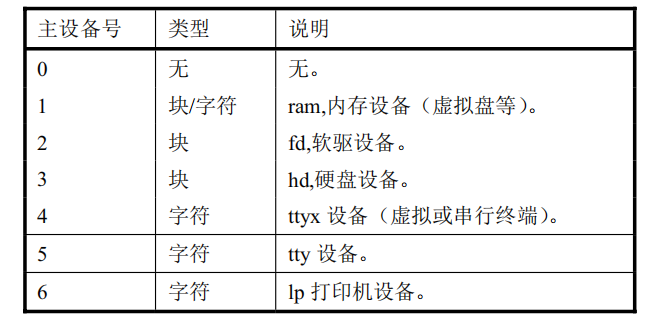

# 设备管理
操作系统的主要功能之一就是与周边的输入输出设备进行通信,采用统一的接口来控制这些外围设 备。操作系统的所有设备可以粗略地分成两种类型：块设备(block device)和字符型设备(character device)。 

- 块设备：是一种可以以固定大小的数据块为单位**进行寻址和访问**的设备,例如硬盘设备和软盘设备。
- 字符设备：是一种以字符流作为操作对象的设备,**不能进行寻址操作**。例如打印机设备、网络接口设备和终端设备。

为了便于管理和访问,操作系统将这些设备统一地以设备号进行分类。在 Linux 0.11 内核中设备 被分成 7 类,即共有 7 个设备号(0 到6)。每个类型中的设备可再根据子(从、次)设备号来加以进一 步区别。下表中列出了各个设备号的设备类型和相关的设备。从表中可以看出某些设备(内存设备)  既可以作为块设备也可以作为字符设备进行访问。

