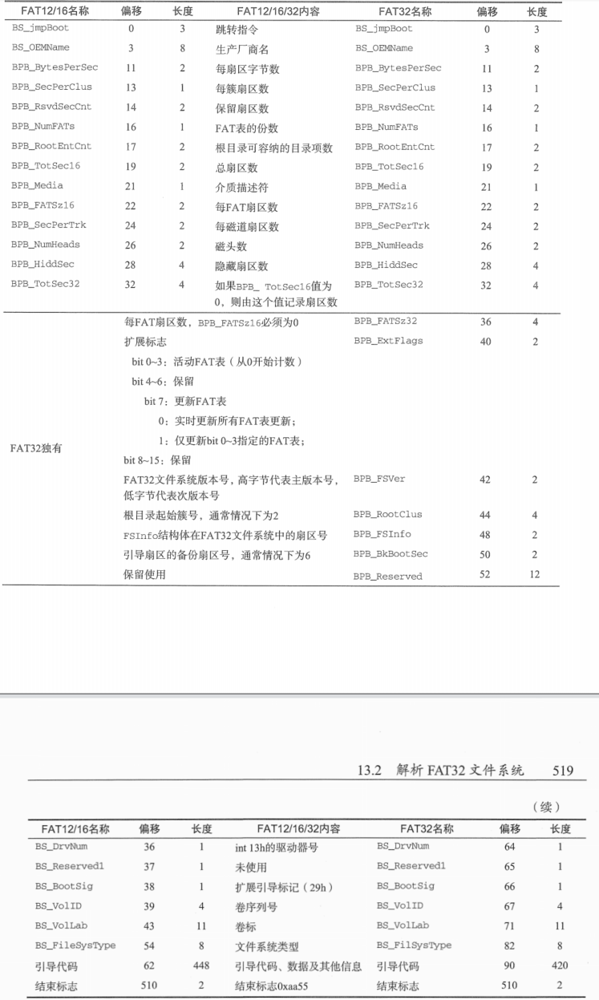
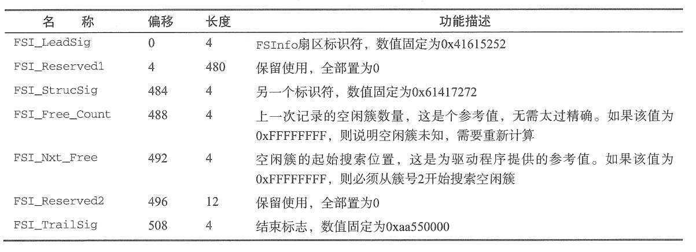
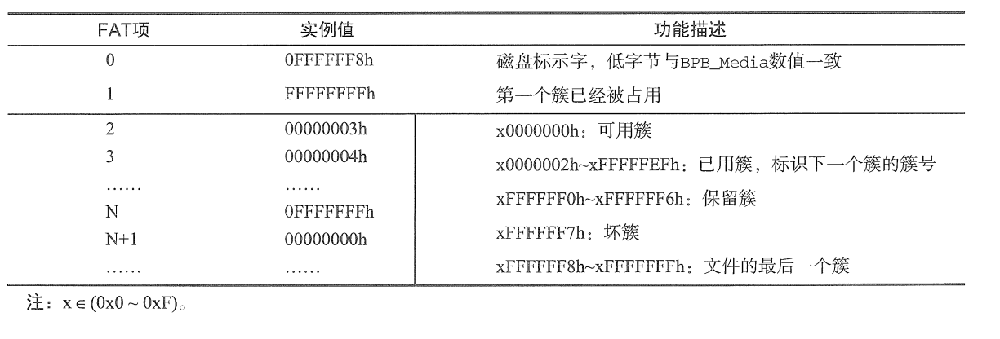
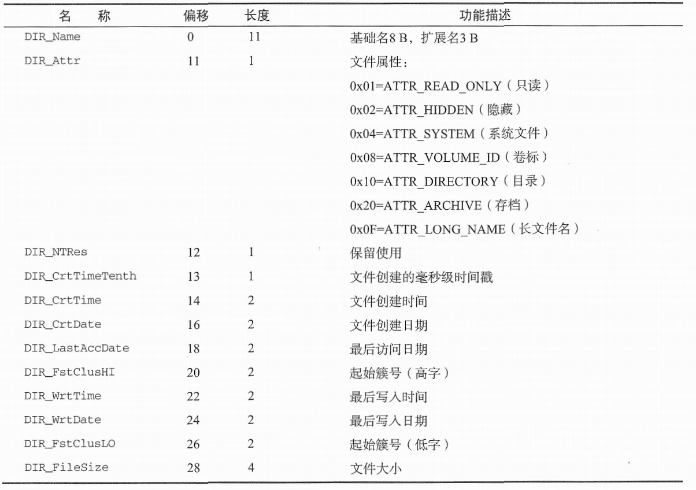
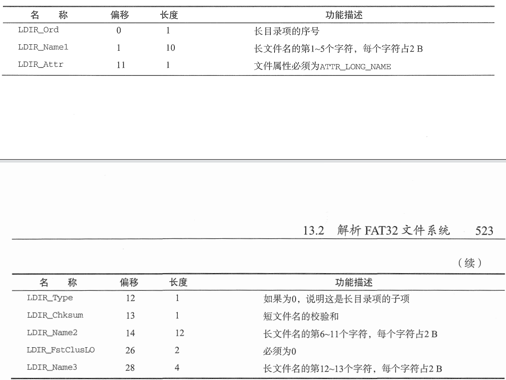

# 解析FAT32文件系统
FAT（File Allocation Table）文件系统自问世以来，历经漫长的岁月，现在已经演化出FAT12、FAT16、FAT32、VFAT、exFAT等多个文件系统版本。

## FAT32文件系统简介
其扇区的组织结构分为引导扇区、FAT表、根目录区和数据区4部分。下面将逐一讲解这4部分内容。

### 引导扇区
引导扇区（Boot Sector）也叫保留区域（Reserved Region），它位于硬盘分区的第一个扇区中，是FAT类文件系统最重要的一个组成部分。引导扇区负责保存FAT文件系统的重要数据信息，表13-1总结了FAT12/16/32三个版本文件系统的引导扇区数据结构。下表为 FAT12/16/32文件系统引导扇区结构对比表：

从上表中可以看出，FAT12与FAT16文件系统采用相同的引导扇区数据结构，而FAT32文件系统则在它们的基础上引入许多成员变量（数据信息），以下是需要额外补充说明的成员变量。

- BS_jmpBoot：在引导程序的起始处，首先定义的是BS_jmpBoot字段。从字面意思可知，它是一句跳转代码，这是由于BS_jmpBoot字段后面的数据不是可执行程序，而是FAT文件系统的组成结构信息，故此必须跳过这部分内容。

- BS_OEMName：记录制造商的名字，亦可自行为文件系统命名。

- BPB_SecPerClus：描述了每簇扇区数。由于每个扇区的容量只有512 B，过小的扇区容量可能会导致读写次数过于频繁，从而引入簇（Cluster）这个概念。簇将2的整数次方个扇区作为一个"原子"数据存储单元，也就是说**簇是FAT类文件系统的最小数据存储单位**。

- BPB_NumFATs。指定FAT12文件系统中FAT表的份数，任何FAT类文件系统都建议此域设置为2。设置为2主要是为了给FAT表准备一个备份表，因此FAT表1与FAT表2内的数据是一样的，FAT表2是FAT表1的数据备份表。

- BPB_RsvdSeccnt：保留区域占用的扇区数量是从硬盘分区的第一个扇区开始计数，引导扇区就包含在保留区域内，因此该成员变量的数值不能为0。对于FAT12/16文件系统而言，保留区域通常只占用1个扇区，而在FAT32文件系统中该值非零即可。

- BPB_TotSec32：记录着总扇区数。这里的总扇区数包括保留扇区（内含引导扇区）、FAT表、根目录区以及数据区占用的全部扇区数。

- BPB_Media。描述存储介质类型。对于不可移动的存储介质而言，标准值是0xF8。对于可移动的存储介质，常用值为0xF0，此域的合法值是0xF0、0xF8、0xF9、0xFA、0xFB、0xFC、0xFD、0xFE、0xFF。另外提醒一点，无论该字段写入了什么数值，同时也必须向FAT【0】的低字节写入相同值。

- BPB_RootEntCnt：对于FAT12/16文件系统而言，该成员变量记录着根目录可使用的目录项数量（32B）。而FAT32文件系统中的该值必须为0。

- BPB_RootClus：此成员变量仅在FAT32文件系统中有效，它指示根目录的起始簇号，通常情况下该数值为2，而数据区的起始簇号同样是2，因此FAT32文件系统的根目录位于数据区的起始簇中。

- BPB_FATSz32：记录着FAT表占用的扇区数。FAT表1和FAT表2拥有相同的容量，它们的容量均由此值记录。

- BS_volLab：指定卷标。它就是Windows或Linux系统中显示的磁盘名。

- BS_FileSyaType。描述文件系统类型。此处的文件系统类型值为'FAT32 '，这个类型值只是一个字符串而已，操作系统并不使用该字段来鉴别FAT类文件系统的类型。

- BPB_FSInfo：该成员变量只在FAT32文件系统中有效，它指示FSInfo结构在保留区域中的扇区号。

- BPB_BkBootSec。该成员变量依然只在FAT32文件系统中有效，它指示引导扇区在保留区域的备份位置（扇区号），通常将引导扇区备份到6号扇区中。FAT32文件系统在备份引导扇区的同时，也会对FSInfo扇区进行备份，其备份位置往往紧随引导扇区备份之后。

根据引导扇区记录的数据，我们不难推算出一些潜在的数据信息，比如，根目录起始扇区号、根目录占用扇区数、数据区起始扇区号、簇的起始扇区号等信息。对于本节主要讨论的FAT32文件系统而言，其根目录区与数据区重合，并不额外占用扇区空间，因此数据区的起始扇区号计算公式如下：

`数据区起始扇区号=BPB_RsvdSecCnt+BPB_FATSZ32×BPB_NumFATs`

对于FAT12/16文件系统来说，要想求得数据区的起始扇区号，仅需把上面的公式的计算结果再加上根目录区占用的扇区数即可。

有了数据区的起始扇区号后，计算簇的起始扇区号就变得容易多了。不过，在计算过程中，还请读者不要忘记数据区的起始簇号是2。假设待访问的簇号为N，那么计算簇N起始扇区号的公式如下：

`簇N的起始扇区号=（（N-2）×BPB_SecPerClus）+数据区起始扇区`

相信借助这两个公式以及FAT表项，在FAT32文件系统中检索文件内的数据将变得非常轻松。

### FSInfo扇区

在FAT32文件系统中，FAT表是一个非常巨大的数据区域。当文件系统经过长时间使用后，计算和索引空闲簇号（FAT表项）等信息就变得非常耗时，尤其是在系统启动期间。鉴于此，FAT32文件系统在保留区域里加入了一个辅助性的扇区结构FSInfo，来帮助文件系统记录这些信息，下表是FSInfo扇区结构的详细定义：

FSInfo扇区结构中的`FSI_Free_Count`和`FSI_Nxt_Free`两个成员变量，主要是为FAT32文件系统在计算和索引空闲簇号过程中提供参考值，它们并非实时更新的准确数值。当这两个成员变量的数值为`0xFFFFFFFFF`时，文件系统就需要重新为它们计算参考值。

### FAT 表
FAT文件系统以簇为单位来分配数据区的存储空间（扇区），每个簇的长度为`BPB_BytesPerSec *BPB_SecPerClus`字节，数据区的簇号与FAT表的表项是一一对应关系。因此，文件在FAT类文件系统的存储单位是簇，而非字节或扇区，即使文件的长度只有一个字节，FAT12文件系统也会为它分配一个簇的磁盘存储空间。此种设计方法可以将磁盘存储空间按固定存储片（页）有效管理起来，进而可以按照文件偏移，分片段访问文件内的数据，就不必一次将文件里的数据全部读取出来。

FAT表中的表项位宽与FAT类型有关，例如，FAT12文件系统的表项位宽为12bit、FAT16文件系统的表项位宽为16 bit、FAT32文件系统的表项位宽为32bit。当一个文件的体积增大时，其所需的磁盘存储空间也会增加，随着时间的推移，文件系统将无法确保文件中的数据存储在连续的磁盘扇区内，文件往往被分成若干个片段。借助FAT表项，可将这些不连续的文件片段按簇号链接起来，这个链接原理与C语言的单向链表极为相似。

虽然FAT32文件系统的每个FAT表项占用4 B空间，但实际上仅低28 bit是有效FAT表项位，高4bit 保留使用。在通常的文件系统操作过程中，文件系统管理程序只会修改FAT表项的低28bit，高4bit保留原值不变。只有在格式化FAT文件系统期间，才会对FAT表项的高4bit进行更改。下表汇总了不同FAT表项值的含义：

其中，FAT[0]（FAT表项0）的低8位在数值上与BPB_Media字段保持一致，剩余位全部设置为1。引导扇区表的BPB_Media字段数值是F0h，故此FAT[0]的值是FF0h。在文件系统初始化期间，已经明确地将FAT[1]赋值为FFFh，想必这是为了防止文件系统误分配该表项。

现在，大部分操作系统的FAT类文件系统驱动程序都直接跳过这两个FAT表项的检索，使它们不再参与计算。因此，FAT[0]和FAT[1]的数值已经不再那么重要了，有时候这两个值为0也是没问题的。我们在编写程序时不必检测它们的数值，直接跳过即可。

### 根目录区和数据区
由于FAT32文件系统在设计时，并未给根目录区分配独立的存储空间，而是将它包含在数据区内。此种设计的好处是根目录区能够动态增长，进而打破根目录在目录项数量方面的限制。

不仅如此，FAT32文件系统在升级目录项结构的同时，还引入长目录项结构，使得文件名和目录名支持长达255个字符，并通过文件属性标志位来区分长短目录项结构。

### 短目录项
短目录项是在原FAT12文件系统目录项的基础上升级扩展而来，它支持32位的FAT表项索引、更丰富的目录项功能以及更详细的时间戳记录，下表是短目录项的详细结构说明:

其中较为特殊的为：

- 起始簇号：当FAT32文件系统的起始簇号由原来的16 bit扩展为32 bit后，由于原起始簇号的数据位宽不足32bit，为了保证目录项格式的兼容性，我们特将32bit起始簇号分割成高16bit和低16 bit两段，并分别将它们保存在不同的成员变量中。
### 长目录项

长目录项结构扩展于短目录项，它将文件名的编码方式从ASCII码升级为Unicode码，使得文件名不仅可以区分大小写字母，同时还支持更多种语言符号，此举弥补了短目录项在文件名记录上的不足之处，算是对文件名的补充说明。长目录项紧随短目录项之后，下表是长目录项的详细结构说明：

