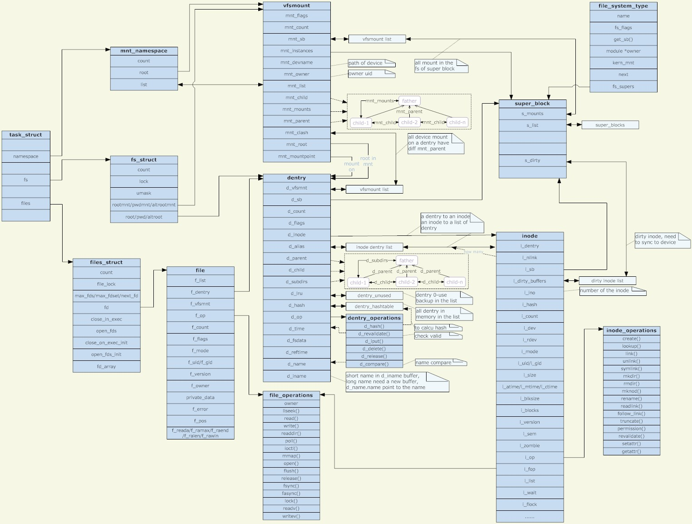

# 虚拟文件系统
## 基本概念
[点击跳转](https://zhuanlan.zhihu.com/p/402127017)

## 数据结构

## mount 源码分析
http://edsionte.com/techblog/archives/4389         

## open close 源码分析
https://www.cnblogs.com/zengyiwen/p/5755186.html

## read write 源码分析
- [read](https://zhuanlan.zhihu.com/p/476181560?utm_id=0)，可同时参考内容基本差不多的[read](https://github.com/lcdzhao/operating_system/blob/master/theory/6.%20%E6%96%87%E4%BB%B6%E7%B3%BB%E7%BB%9F/2.%20%E8%99%9A%E6%8B%9F%E6%96%87%E4%BB%B6%E7%B3%BB%E7%BB%9F/README.assets/Linux.Kernel.Read.Procedure.pdf)

- [write](https://github.com/lcdzhao/operating_system/blob/master/theory/6.%20%E6%96%87%E4%BB%B6%E7%B3%BB%E7%BB%9F/2.%20%E8%99%9A%E6%8B%9F%E6%96%87%E4%BB%B6%E7%B3%BB%E7%BB%9F/README.assets/Linux.Kernel.Write.Procedure.pdf)

## Linux内核的文件预读机制详细详解
- [Linux内核的文件预读机制详细详解](https://blog.csdn.net/kunyus/article/details/104620057)

其他可以参考的文章：

  - [Linux内核的文件预读readahead查看与设置](https://blog.51cto.com/u_15338523/3592323)
  
  - [Linux Cache 机制与预读](https://github.com/lcdzhao/operating_system/blob/master/theory/6.%20%E6%96%87%E4%BB%B6%E7%B3%BB%E7%BB%9F/2.%20%E8%99%9A%E6%8B%9F%E6%96%87%E4%BB%B6%E7%B3%BB%E7%BB%9F/README.assets/Linux.Kernel.Cache.pdf)

## mmap的好处
- 减少内核空间到用户空间的数据拷贝
- 减少系统调用次数

## mmap缺页处理 与 Page Cache 刷脏源码分析
[mmap缺页处理 与 Page Cache 刷脏源码分析](https://www.leviathan.vip/2019/06/01/Linux%E5%86%85%E6%A0%B8%E6%BA%90%E7%A0%81%E5%88%86%E6%9E%90-Page-Cache%E5%8E%9F%E7%90%86%E5%88%86%E6%9E%90/) -- 关于这篇文章里面的 缺页添加page，有下面几个注意点；

- 该过程仅仅为文件通过mmap的缺页处理过程，并不是平常文件读取的过程。附：[Linux 缺页处理](https://www.leviathan.vip/2019/03/03/Linux%E5%86%85%E6%A0%B8%E6%BA%90%E7%A0%81%E5%88%86%E6%9E%90-%E5%86%85%E5%AD%98%E8%AF%B7%E9%A1%B5%E6%9C%BA%E5%88%B6/)

- 缺页处理过程这个文章里面讲page将会插入到pagecache，实际上真正能让应用程序读到page并不是因为将其加入到了pagecache（而是将该page映射到虚拟内存，加入到pagecache和映射到虚拟内存是两回事），加入pagecache只是为了让该文件同时被普通读（非mmap读）的时候不再需要去重复地去内存再去读，其与mmap对应到的page缓存相同，一方面不会有赘余空间，另一方面又减少一次读硬盘。也即：mmap和普通读所用的缓存统一起来了，做到了不赘余。这块和2.6版本将 pagecache 与 buffer 合一有点像，都是减少了不必要的多份数据，即避免了数据同步的问题，又可以提升性能。

## 块缓存与pagecache
在内核2.6版本以前，在读文件时，回先将文件读到块缓存中（硬盘驱动读数据时需要将数据读到某一块缓存），然后再从块缓存拷贝到pagecache中。猜测当时这么做是为了代码上的清晰，有种单一职责的感觉，将读硬盘的指责与文件页缓存的职责分开。

这么做尽管代码职责更加清晰，但是无疑增加了数据的拷贝次数与不必要的空间占用。因此在2.6版本中将块缓存直接通过 buffer_head 映射到 pagecache中的page。

## 零拷贝
通过上面我们会发现读文件时内核会有缓存，目的是为了减少硬盘读取的次数。但是如果当我们需要一次性读整个文件时，便不再有必要让内核去缓存数据，因为只读一次，的确不需要这样一层缓存，因此此时可以直接将整个文件读取到 用户内存 或者 网卡即可。因此内核版本2.1增加了 sendfile 系统调用来完成这件事情。关于零拷贝更加详细的讲解可以参看：

- [0拷贝](https://blog.csdn.net/m0_68064743/article/details/123956987)

- [网络、 DMA 与 0拷贝](https://blog.csdn.net/hancoder/article/details/112149121)

- [socket使用mmap](https://blog.csdn.net/ruixj/article/details/4153118)

- [socket的mmap模式](https://blog.csdn.net/qq_17045267/article/details/117994823)

# 其他讲解方式
> 来源: https://ilinuxkernel.com/

    在块设备上的操作，涉及内核中的多个组成部分，如图1所示。假设一个进程使用系统调用read（）读取磁盘上的文件。下面步骤是内核响应进程读请求的步骤；

（1）系统调用read（）会触发相应的VFS（Virtual Filesystem Switch）函数，传递的参数有文件描述符和文件偏移量。

（2）VFS确定请求的数据是否已经在内存缓冲区中；若数据不在内存中，确定如何执行读操作。

（3）假设内核必须从块设备上读取数据，这样内核就必须确定数据在物理设备上的位置。这由映射层（Mapping Layer）来完成。

（4）此时内核通过通用块设备层（Generic Block Layer）在块设备上执行读操作，启动I/O操作，传输请求的数据。

（5）在通用块设备层之下是I/O调度层（I/O Scheduler Layer），根据内核的调度策略，对等待的I/O等待队列排序。

（6）最后，块设备驱动（Block Device Driver）通过向磁盘控制器发送相应的命令，执行真正的数据传输。

其中：

- 关于(1) (2) ，见:[Linux虚拟文件系统](https://github.com/lcdzhao/operating_system/blob/master/theory/6.%20%E6%96%87%E4%BB%B6%E7%B3%BB%E7%BB%9F/2.%20%E8%99%9A%E6%8B%9F%E6%96%87%E4%BB%B6%E7%B3%BB%E7%BB%9F/README.assets/Linux.Virtual.Filesystem.pdf)

- 关于(3)，见：[Linux内核文件Cache机制](https://github.com/lcdzhao/operating_system/blob/master/theory/6.%20%E6%96%87%E4%BB%B6%E7%B3%BB%E7%BB%9F/2.%20%E8%99%9A%E6%8B%9F%E6%96%87%E4%BB%B6%E7%B3%BB%E7%BB%9F/README.assets/Linux.Kernel.Cache.pdf)

- 关于(4)，见: [Linux通用块设备层](https://github.com/lcdzhao/operating_system/blob/master/theory/6.%20%E6%96%87%E4%BB%B6%E7%B3%BB%E7%BB%9F/2.%20%E8%99%9A%E6%8B%9F%E6%96%87%E4%BB%B6%E7%B3%BB%E7%BB%9F/README.assets/Linux.Generic.Block.Layer.pdf)

- 关于(5)，见：[Linux内核I/O调度层](https://github.com/lcdzhao/operating_system/blob/master/theory/6.%20%E6%96%87%E4%BB%B6%E7%B3%BB%E7%BB%9F/2.%20%E8%99%9A%E6%8B%9F%E6%96%87%E4%BB%B6%E7%B3%BB%E7%BB%9F/README.assets/Linux.Kernel.IO.Scheduler.pdf)

- 关于(6)，这里就不展开讲解了。
