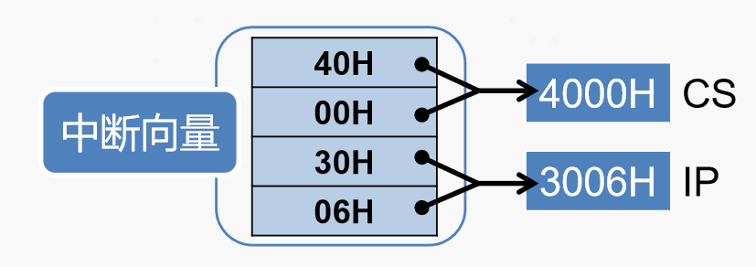

# 中断
## 中断的定义
CPU遇到的“事件”：

> - 在程序运行时，系统外部、内部或现行程序本身出现需 要特殊处理的“事件” 
> - CPU立即强行中止现行程序的运行，改变机器的工作状 态并启动相应的程序来处理这些“事件” 
> - 处理完成后，CPU恢复原来的程序运行

这些“事件”被称为“中断”或“异常”。
## 中断相关的硬件电路
[北京大学——计算机组成与设计——中断](https://www.bilibili.com/video/BV1tp4y197Av?p=46)
## 中断的进步
### Intel  8086（1978年） 

#### 实模式下的存储器地址空间 

#### 中断向量（interrupt vector） —— 中断服务程序的入口地址 

#### 中断向量和中断服务程序

#### 8086的中断向量表 —— 由`BIOS`初始化放置到`0x00000`的位置

### 保护模式(IA-32)的中断操作
> 中断向量表位置不同，每个中断描述符8个字节，256个中断描述符共2K字节，其它操作与实模式类似。

### 软中断 —— 中断线程化
// 未来要做这块功能时，再来写这一部分

## 中断执行

### 影响的寄存器

### 中断分类

### IDT表项

# 系统调用
## 何为系统调用

## 为什么要有系统调用

## 系统调用如何实现

### 中断如何将cpu转换为内核态

# 代码实现
## linux 0.11 中`IDT`相关实现
### 启动时`IDT`

### 初始化`IDT`

## `系统调用`相关实现
### 系统调用初始化

### 进行系统调用
