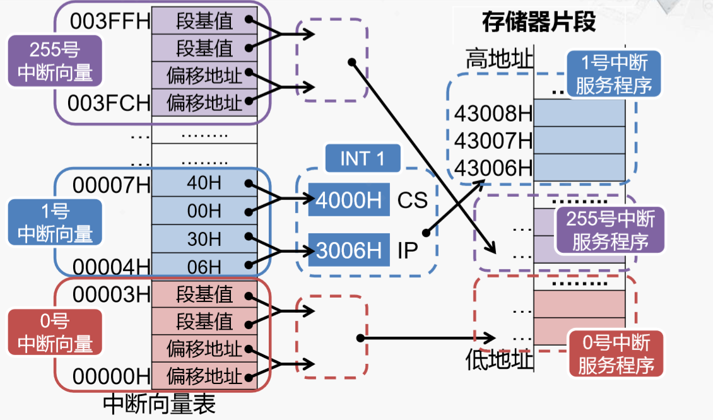
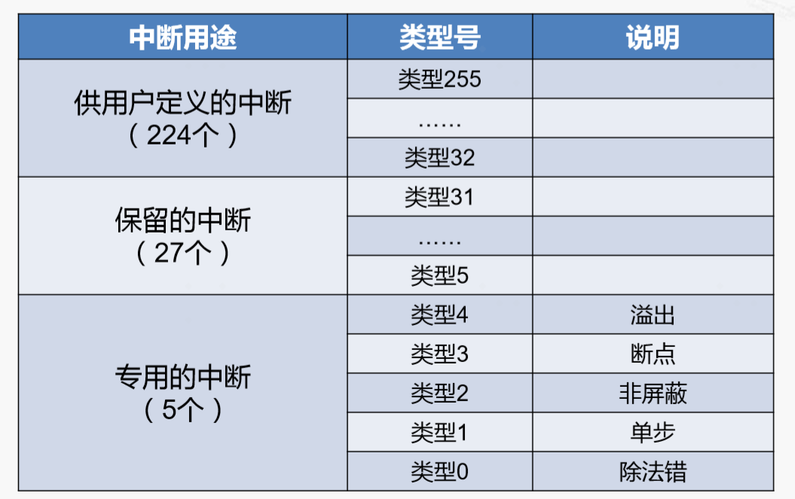
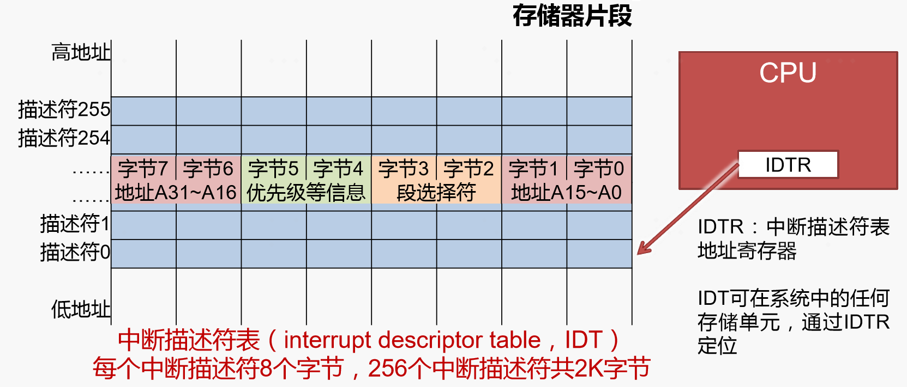

# 中断
## 中断的定义
CPU遇到的“事件”：

> - 在程序运行时，系统外部、内部或现行程序本身出现需 要特殊处理的“事件” 
> - CPU立即强行中止现行程序的运行，改变机器的工作状 态并启动相应的程序来处理这些“事件” 
> - 处理完成后，CPU恢复原来的程序运行

这些“事件”被称为“中断”或“异常”。
## 中断相关的硬件电路
[北京大学——计算机组成与设计——中断](https://www.bilibili.com/video/BV1tp4y197Av?p=46)
## 中断的进步
### Intel  8086（1978年） 

#### 实模式下的存储器地址空间 
> 存储器中保留两个专用区域
> 
>  • 中断向量表区：00000H~003FFH（地址最低的1KB） 
>  
>  • 初始化程序区：FFFF0H~FFFFFH（地址最高的16B）

#### 中断向量（interrupt vector） —— 中断服务程序的入口地址 
> 每个中断类型对应一个中断向量（4字节） 
> 
> ◦ 前两个字节单元存放中断服务程序入口地址的偏移量（IP）， 低字节在前，高字节在后 
> 
> ◦ 后两个字节单元存放中断服务程序入口地址的段基值（CS）， 低字节在前，高字节在后

#### 中断向量和中断服务程序

#### 8086的中断向量表
> 由`BIOS`初始化放置到`0x00000`的位置。

### 保护模式(IA-32)的中断操作
> 中断向量表位置不同，每个中断描述符8个字节，256个中断描述符共2K字节，其它操作与实模式类似。

### 内部中断类型说明
[内部中断类型说明（点击查看）](README.assets/805-内部中断分类说明.pdf)

### 软中断 —— 中断线程化
// 未来要做这块功能时，再来写这一部分

## 中断执行

### 处理过程

> 1. 关中断: CPU关闭中断响应，即不再接受其它外部中断请求
> 2. 保存断点 : 将发生中断处的指令地址压入堆栈，以使中断处理完后能正确地返回
> 3. 识别中断源 : CPU识别中断的来源，确定中断类型号，从而找到相应的中断服务程序 的入口地址
> 4. 保护现场 : 将发生中断处的有关寄存器（中断服务程序中要使用的寄存器）以及标 志寄存器的内容压入堆栈
> 5. 执行中断服务程序 : 转到中断服务程序入口开始执行，可在适当时刻重新开放中断，以便允 许响应较高优先级的外部中断
> 6. 恢复现场并返回 : 把“保护现场”时压入堆栈的信息弹回原寄存器，然后执行中断返回指 令，从而返回主程序继续运行

上面步骤中：
**1、2、3 由CPU自己完成，4、5、6由中断服务来完成**
其中**第2步**会自动**将 CS、IP、PSW三个寄存器压栈**，因此在**第4步**保护现场时，**不再需要将CS、IP、PSW进行入栈操作，而需要将其它寄存器进行入栈**，**第6步恢复现场时，也只需要恢复其它寄存器的值，而返回时执行`IRET`指令即可使 旧的CS/IP/PSW 弹出堆栈**。

### 中断分类

### IDT表项

# 系统调用
## 何为系统调用

## 为什么要有系统调用

## 系统调用如何实现

### 中断如何将cpu转换为内核态

# 代码实现
## linux 0.11 中`IDT`相关实现
### 启动时`IDT`

### 初始化`IDT`

## `系统调用`相关实现
### 系统调用初始化

### 进行系统调用
