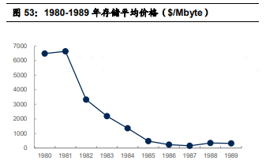
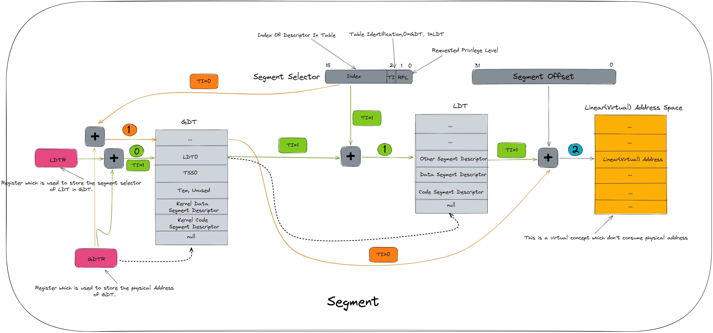
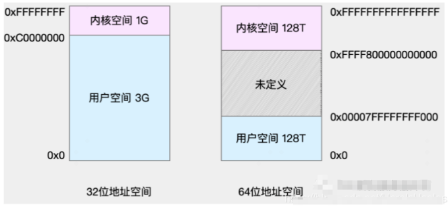
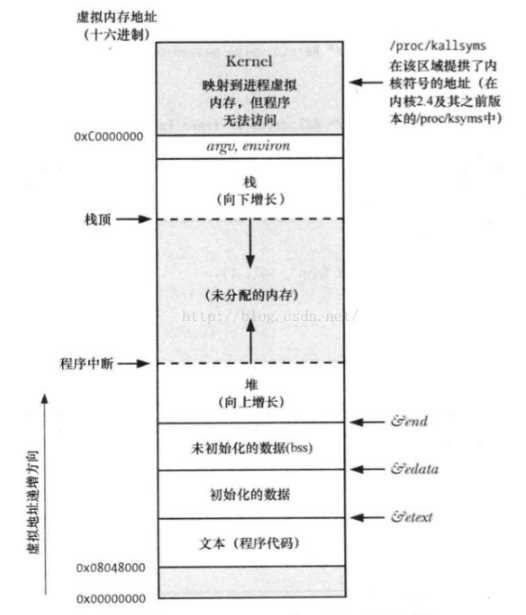
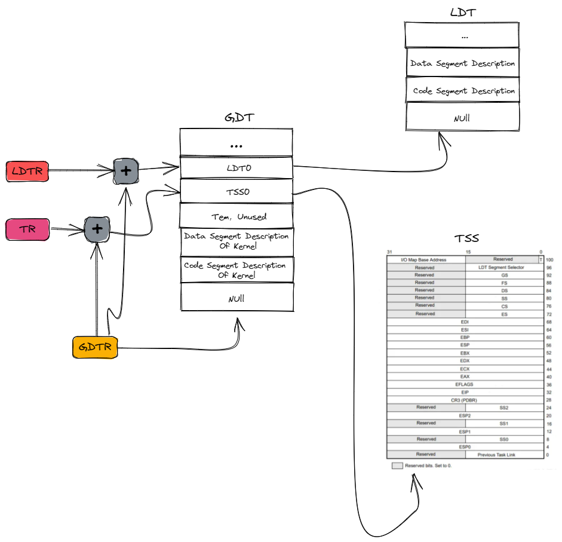
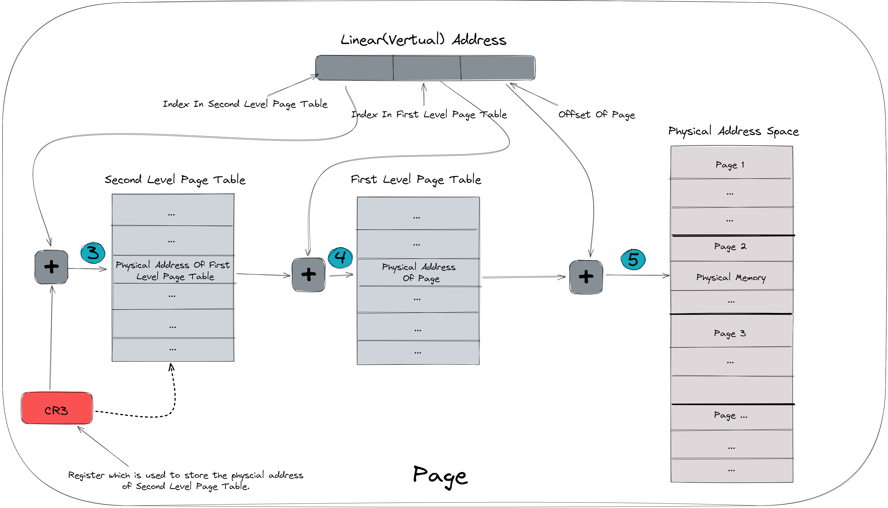

# 实模式和保护模式是什么
## 实模式
实模式出现于早期8088CPU时期，当时的操作系统很简单，大多数都是用在一个固定用途的机器上，即使是当时所谓的通用计算机，程序也大多都是使用这个机器的人来进行编写，很少有现在的一个机器上跑着到处下载来的应用，因此当时操作系统的需求很简单，能提供基本的功能就行，不太要求多个应用之间的隔离性和安全性等。所以那个时候的所有的应用的寻址方式都是一样的，都可以访问到任意物理地址的空间("实"指的大概就是这个)，它的寻址方式如下：

> 物理地址 = 段基址(cs、ds、ss、es等段寄存器)<<4 + 段内偏移(ip、di、si、bp、sp等寄存器)

之所以使用 `段基址<<4 + 段内偏移`的计算方式，大概有两个原因：
- **在硬件层面上提供 代码段、数据段、堆栈段 的分离，便于程序员分离(分段)管理这些数据，大大减少其工作量，简化其工作**。使用久了高级语言的程序员或许会觉得，分离这些东西有什么用，自己分离不就行了，但是让我们来想一想，如果CPU在硬件层面不提供这些，我们自己要分离管理这些数据的话，要怎么做呢？CPU可不能提供 List、Map 这些数据结构。是不是还挺复杂的，**即使有解决方案，性能上肯定也比不过使用 段寄存器 来直接进行分段管理**。
- **扩展地址空间**：如果仅仅使用一个16位的寄存器来进行访问地址空间，那么地址空间只有16位，这个地址空间的大小即使在那个时代，也显得很小，甚至有些许不够用。因此当时使用`段基址<<4 + 段内偏移`的方式来扩展内存的地址空间，将其扩展到了 20 位，对应的大小为`1MB`。也许你会觉得`1MB`也太小了吧，但是在当时`1MB`可是很多人梦寐以求的大小。其价格接近上万美元(那个时候的1万美元和现在可不一样)。


## 保护模式
为了让计算机可以进一步发展，让用户可以安全地下载并使用任何地方来的应用程序，这个时候对操作系统提出了更高的要求，即：需要保证多个应用之间的相互独立及安全性，且用户程序无法破环操作系统的数据(这样即使某个应用程序是恶意软件，也不会影响操作操作系统的代码(除非操作系统自己有漏洞)，只要用户重启就可以解决大多数问题(所以遇到问题，先重启试试^-^))，这就要求**多个应用之间的数据都进行隔离，一个应用无法访问另一个应用的数据**。

要实现上面这个需求，有下面俩种方式实现：

- 操作系统发现这个应用访问其它地址时，直接报错。——  操作系统需要在运行或者启动时对每一个访存指令进行检查，性能低下。
- 在CPU层面不允许当前应用访问其它应用的地址。—— 保护模式，性能更高，也更加灵活。

为了实现这个目的，寻址方式必须进行改变，不能再继续使用实模式的`物理地址 = 段基址<<4 + 段内偏移`的方式进行寻址，而是提出了保护模式这种新的模式，这个模式的目的如其名就是为了"保护"，这种模式下的寻址方式使用的是下面的段页结合的方式进行寻址：


看起来要比实模式复杂得多，确实，新的模式尽管很好，但也的确引入了很大的复杂度，不过一切的设计都是很合理的，下面我们来具体分析分析一下上面这个图。

### 分段寻址(虚拟内存)

#### 目的
> 使用`段选择符(cs、ds、ss、es等段寄存器) 与 段内偏移(ip、di、si、bp、sp等寄存器)` 来对当前应用程序的虚拟内存进行读写访问。
#### 虚拟内存
`虚拟内存`是实现"保护"的精髓，它使得**应用程序认为它拥有连续可用的内存（一个连续完整的地址空间，如32为操作系统下，应用认为自己拥有4GB的连续内存空间）**，而实际上物理内存通常被分隔成多个内存碎片(**如何将应用程序的虚拟内存映射为实际物理内存由操作系统和底层硬件控制，用户程序无法控制。通过这样使得用户程序仅能访问自己内存空间的内存，而无法取访问其它应用的内存空间**)，还有部分暂时存储在外部磁盘存储器的swap分区上，在需要时进行数据交换。





这一章节的主要目的是讲清楚实模式与保护模式，因此关于**内存管理**更加详细的讲解将在以后单独的章节进行讲解。
#### 段选择子


如上图所示:

> - 第0-1位(**RPL**): 表示**选择子的特权级**，共有四个特权级(0级，1级，2级，3级)。在程序中的每一个段都有一个特定的特权级，每当一个程序试图访问某一个段时，就将该程序所拥有的特权级(CS中的特权级)与要访问的特权级进行比较（数字越小级别越高），特权级高的才可以访问，否则不可以访问。第0位系统规定，CPU只能访问同一个特权级或者级别较低特权级的段。
> 
> - 第2位(**TI**)： 指出访问的是全局描述符表[GDT]（0）还是局部描述符表[LDT]（1）。
> 
> - 第3-15位(**Index**)：是LDT或GDT表的表项编号，指明在表中的位置。找到相应的描述符后使用sel:offset转换为线性地址。所以描述符表最大能够存储2^13=8KB个描述符。

##### 段选择子寻址
32位操作系统不再直接使用`段基址<<4 + 段内偏移`的方式来进行地址访问，而是先使用`段选择子(cs、ds、ss、es等段寄存器)`定位到`段描述符`，定位过程：
> `段描述符物理地址 = LDTR(本地段描述符表起始位置)/GDTR(全局段描述符起始位置) + (Index * 段描述符大小))` —— **对应上图中的步骤1**

然后从`段描述符`中获取段基址，再通过
> `虚拟内存地址 = 段基址 + 段内偏移(ip、di、si、bp、sp等寄存器)`  —— **对应上图中的步骤2**

的方式来定位到虚拟内存的地址从而访问。(其中虚拟内存还需要进行进一步的转换才能变成物理内存，以后单独的章节进行讲解)

###### 举例：给出逻辑地址：`0x21:0x12345678` 转换为线性(虚拟)地址
>
> STEP1: 选择子 `SEL = 0x21 = 0000000000100 0 01` 所代表的意思是：最后的`01`代表特权级`RPL=1`；`TI=0`代表选择子是在GDT选择；选择子的`Index=4`即`100`选择GDT中的第4个描述符；
> 
> STEP2: `OFFSET = 0x12345678` 若此时GDT第四个描述符中描述的段基址（Base）为`0x11111111`，则`线性地址 = 0x11111111 + 0x12345678 = 0x23456789`

##### 为什么不直接使用段基址，而是使用段选择子
如果直接使用段基址，那么一个应用中的段的个数已经被CPU中的段寄存器个数所决定，其无法再进行下一步扩展，**大大限制了操作系统与应用程序的灵活性**。

而使用段选择子，则用户可以在LDT中任意扩展自己的段，操作系统可以GDT中任意扩展段(如：在GDT中保存了所有的LDT)，**大大提高了操作系统与应用程序的灵活性**。

#### GDT（Global Descriptor Table）
在操作系统中，一个处理器对应一个全局描述符表GDT，GDT可以被放在内存的任何位置，但CPU必须知道GDT的入口，也就是基地址放在哪里，X86系列CPU芯片中提供了一个寄存器`GDTR`用来存放GDT的入口地址，程序员将GDT设定在内存中某个位置之后，可以通过`LGDT`指令将GDT的入口地址装入此寄存器，从此以后，CPU就根据此寄存器中的内容作为GDT的入口来访问GDT了。

##### GDTR


基地址(**Base Address**)指定GDT表的起始地址在线性(虚拟)地址空间中的地址，表长度(**Table Length**)指明GDT表的字节长度值。指令`LGDT`和`SGDT`分别用于加载和保存`GDTR`寄存器的内容。在机器刚加电或处理器复位后，基地址被默认地设置为0，而长度值被设置成0xFFFF。在保护模式初始化过程中必须给GDTR加载一个新值。

##### GDT 表项

GDT中的每一项都是一个段描述符，因此GDT实际上是一个段描述符的数组，段描述符的结构如下图所示:


- G：
>（1）G=0时，段限长的20位为实际段限长，最大限长为2^20=1MB
>
>（2）G=1时，则实际段限长为20位段限长乘以2^12=4KB，最大限长达到4GB

- D/B：
>（1） 当描述符指向的是可执行**代码段**时，这一位叫做D位，D=1使用32位地址和32位操作数，D=0使用16位地址和16位操作数。
> 
>（2） 如果指向的是向下扩展的**数据段**，这一位叫做B位，B=1时段的上界为4GB，B=0时段的上界为64KB。
> 
>（3） 如果指向的是**堆栈段**，这一位叫做B位，B=1使用32位操作数，堆栈指针用ESP，B=0时使用16位操作数，堆栈指针用SP。

- DPL：
> 特权级，0为最高特权级，3为最低，表示访问该段时CPU所需处于的最低特权级(如果CS的CPL特权级低于DPL，则当前应用不可以访问该段)。

- AVL：系统软件可用位

- P：段存在

- S：描述符类型(0:系统，1:代码或数据)

- Type :  段类型


#### LDT

##### LDTR

##### Linux 0.1.1 中的 GDT 与 LDT



##### Linux 0.1.1 初始化GDT部分源码

##### Linux 0.1.1 初始化LDT部分源码


### 分页寻址(虚拟内存转化为物理内存)


- 步骤3：
- 步骤4：
- 步骤5：

这一章节的主要目的是讲清楚实模式与保护模式，因此关于**内存管理**更加详细的讲解将在以后单独的章节进行讲解。


## 如何切换至保护模式

### linux 0.1.1 中如何实现切换至保护模式
```
mov eax,cr0
or eax,1
mov cr0,eax
jmp dword 0x08:start    # 清空流水线，并传串行化处理器。其中，0x08就是32位程序所在段的段选择子，结构见下面，start为偏移地址。
```
## linux 0.1.1 中保护模式如何访存

### 用户态如何访存

### 内核态如何访存

#### 如何访问用户空间

#### 如何访问内核空间

#### 如何在用户空间与内核空间传递数据

# 设计原因
## 为什么要段页结合的方式进行寻址
### 为什么要分段
#### 分段的好处
这个问题上面已经回答过了，这里再来抄一遍：
> **在硬件层面上提供 代码段、数据段、堆栈段 的分离，便于程序员分离(分段)管理这些数据，大大减少其工作量，简化其工作**。使用久了高级语言的程序员或许会觉得，分离这些东西有什么用，自己分离不就行了，但是让我们来想一想，如果CPU在硬件层面不提供这些，我们自己要分离管理这些数据的话，要怎么做呢？CPU可不能提供 List、Map 这些数据结构。是不是还挺复杂的，**即使有解决方案，性能上肯定也比不过使用 段寄存器 来直接进行分段管理**。

因为32位操作系统的地址空间已经足够了，因此这里没有扩展地址空间的作用。
#### 为什么不直接使用分页
访问一个段的数据，对于汇编程序员来说很容易(使用 `段基址:段内偏移` 就可以实现) ，但是如果访问页的数据对于汇编程序员来说过于复杂，如：

- 访问代码段：`cs:eip`  这样就可以访问代码段，如果让程序员用页的方式去访问，你能想到怎么搞吗? 要每次访问都要自己去写管理页的代码吗? 想想就很复杂

### 为什么要分页
如果仅仅只有分段的话，且要实现内存保护功能(靠虚拟内存实现)的话，有下面两种方式：

> - 内存分配以段为单位，物理内存中保存用户虚拟段到物理实际段之间的映射关系。—— 缺点：段的空间过大，以段为单位进行内存分配，容易导致产生很多内存碎片，从而使得内存利用率较低。
> - 内存分配以每个地址为单位，物理内存中保存用户虚拟内存到物理实际内存之间的映射关系。—— 缺点：虚拟内存与实际内存一一对应，这样虚拟内存到实际内存的映射表的大小将会和物理内存本身一样大，也就是说所有的内存都会用来存放这张映射表，因此也无法实现。

通过对上面两种情况进行分析，我们会发现：

> - **以段为单位进行内存分配，容易导致产生很多内存碎片，从而使得内存利用率较低**。
> - **以每个地址为单位进行内存分配**，会导致整个物理内存都用来存放虚拟内存到物理内存的映射表，即**映射表太大**。

那么有没有一种方式，即能使**内存利用率高**，又可以使得**虚拟内存到物理内存之间的映射表不至于太大**。 没错，这种方案就是**分页**：

> 内存分配以页为单位，通常一页大小为`4KB`，物理内存中保存虚拟页到实际页之间的映射关系。

这样设计将会使得**内存的利用率**比以段为单位分配内存**高很多**，虚拟页与实际页之间的**映射表**也会比虚拟地址到实际地址之间的映射表**小很多**。因此，操作系统的最终设计使用了分页来进行内存分配。

#### 为什么要多级分页
紧接着上一个小节，使用分页功能进行内存管理，那么每个应用都需要在物理内存中保存虚拟页与实际页的映射表(页表)，该映射表(页表)的大小的计算方式如下：
> 页表大小 = 页表项大小 * 页表项个数
> 页表项个数 = 虚拟内存大小/页面大小

##### 页表项个数
页表项的作用是找到该页在内存的位置，以32位逻辑地址空间，字节为编址单位，一页`4KB`为例，地址空间内一共含有 `4GB/4KB = 1M` 页。
##### 页表项大小
由上一小节可知，页表项的个数为`1M`页，则需要 `log1M = 20` 位才能保证表示范围能容纳所有页面，又因为以字节位编址单位，即`页表项的大小>=[20/8]=3B`，所以在这个条件下，为了保证页表项能够指向所有页面，那么页表项的大小应该大于`3B`，当然，也可以选择更大的页表项以至于让一个页面能够正好容下整数个页表项以方便存储。(如：取`4B`，那么一页正好可以装下`1K`个页表项)，或者增加一些其它信息。
##### 不分级页表大小
则在 32位系统中：`页表大小 = 页表项大小 * 页表项个数 = 1M * 4B = 4MB`。
**因此如果不进行分级，在32位操作系统种每个应用都需要使用`4MB`的大小(在64位系统上这个值更大)来存放页表**。尽管现在大家可能会说4MB不是很小吗，**但是在32位CPU诞生之初，`1MB`的内存价格也在上千人民币。因此那个时候大家拼了命也想将页表进行缩小。于是便有了多级页表技术**。

##### 多级分页
将`1M`个页表项分成两级，变成`1K * 1K`的大小，这样，只需要将第二级页表存放在内存中，其索引到的第一级页表被使用时再生成并初始化，不使用时就不生成。这样就只有第二级页表不得不保存在物理内存中，其大小为`4KB`(**多级页表的页表项直接存放该项对应的那一个下一级的页表的起始物理地址。而不是在某一个位置记录一个所有的下一级页表的起始地址，然后在页表项中存放下一级页面的索引号，如果这样操作，则意味着，下一级的所有页表都为连续的，那么这一部分空间也要提前占用，避免被其它应用占用，这就又变成了分级前的样子**)。当然64位操作系统由于本身地址空间较大(导致虚拟内存较大)，所以即使分成两级，还是会占用很大的内存，因此64位操作系统一般会分为更多级(由于级别越多，性能越差，因此一般分为4级)。


### 结论 
之所以使用段页结合的方式来进行内存管理，是因为：

> - 面向程序员使用**分段**的方式，**硬件层面提供数据分离**，可以使程序员**更容易**地写出**性能更高**代码。
> - 面向物理内存使用**分页**的方式，既能**提高物理内存的利用率**，又可以使得虚拟内存到物理内存之间的**映射表占用的物理内存大大减小**。

因此，操作系统最终采用段页结合的方式来进行内存管理。
