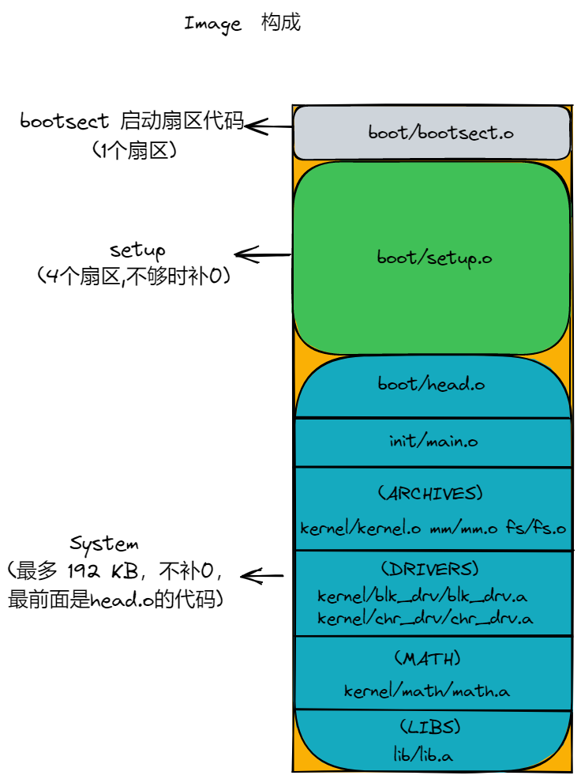
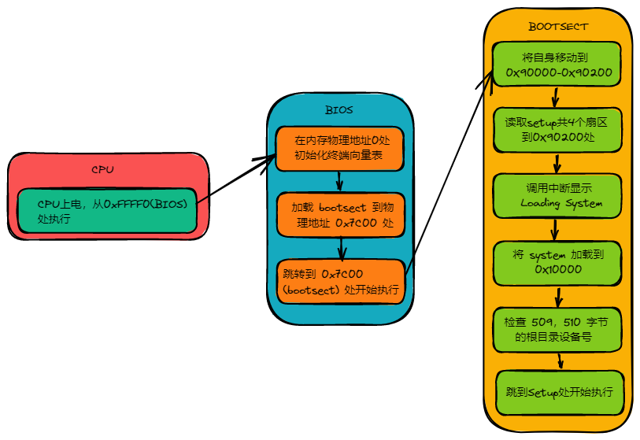
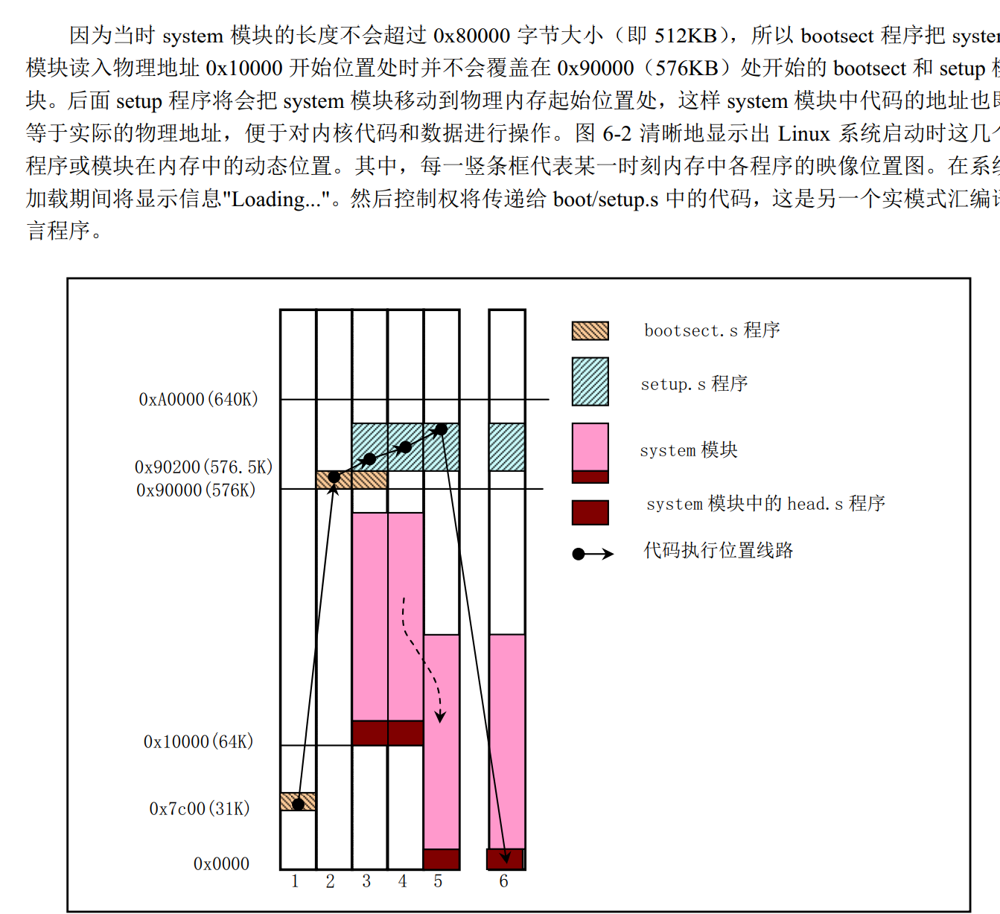
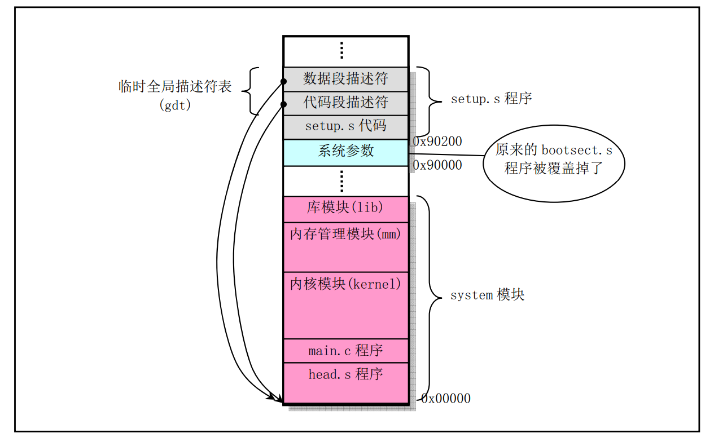
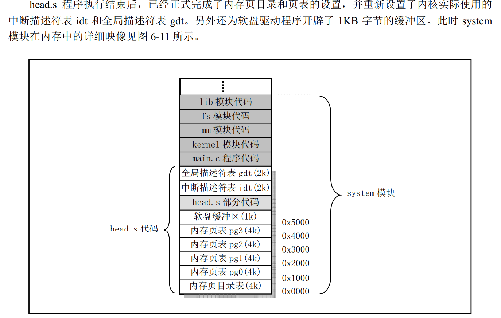
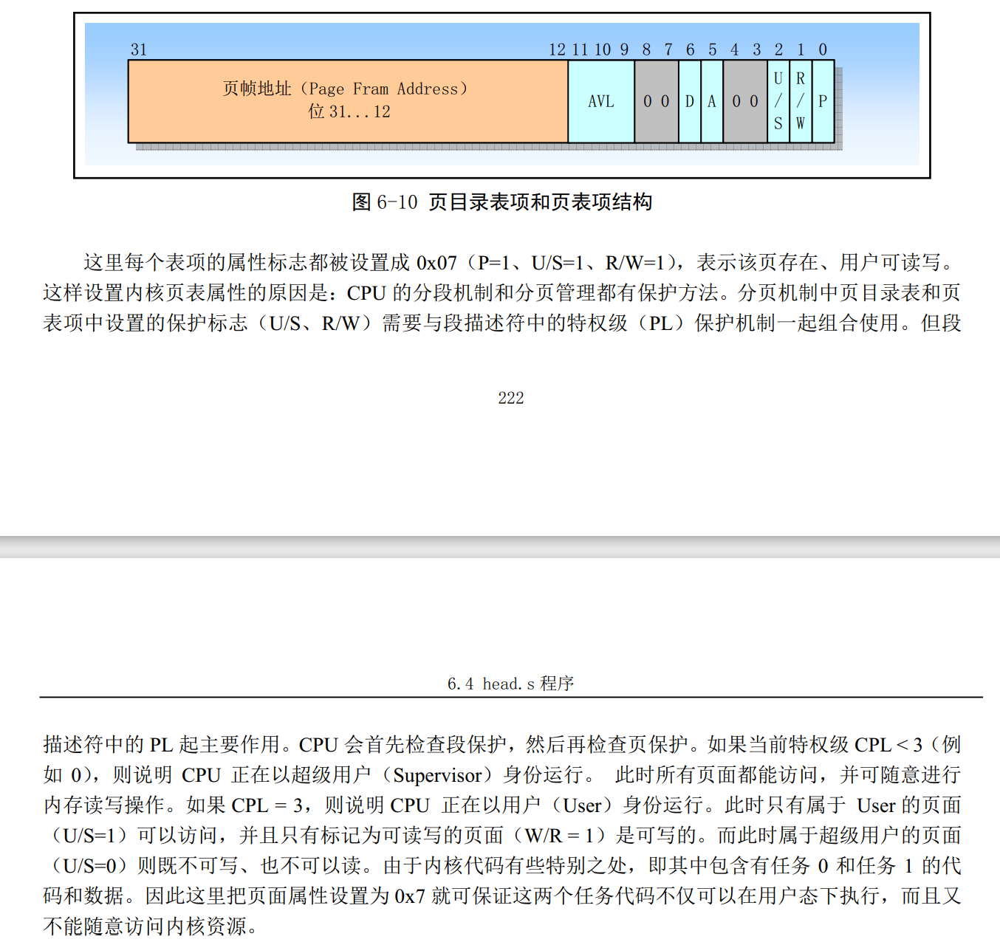

# 内核启动过程

## Image 文件构成
Image 文件的构成由`Makefile`所指定。
### Makefile
> 如果对于C语言的编译过程不熟悉的话，建议在阅读本节之前先阅读一下 [C语言编译与标准库、系统调用](https://github.com/lcdzhao/operating_system/tree/master/theory/C%E8%AF%AD%E8%A8%80%E7%9B%B8%E5%85%B3/C%E8%AF%AD%E8%A8%80%E7%BC%96%E8%AF%91%E4%B8%8E%E6%A0%87%E5%87%86%E5%BA%93%E3%80%81%E7%B3%BB%E7%BB%9F%E8%B0%83%E7%94%A8)，看懂Makefile需要掌握C语言编译相关知识。


在Linux 0.11 源码的根目录的[Makefile文件](https://github.com/lcdzhao/operating_system/blob/master/linux-0.1.1-labs/linux-0.1.1/Makefile)中，核心字段如下：
```makefile
# 开头的这一大段主要进行makefile中的各种变量
# 
# if you want the ram-disk device, define this to be the
# size in blocks.
#
RAMDISK =  #-DRAMDISK=512

AS86	=as86 -0 -a
LD86	=ld86 -0

AS	=as
LD	=ld
LDFLAGS	=-m elf_i386 -Ttext 0 -e startup_32
CC	=gcc-3.4 -march=i386 $(RAMDISK)
CFLAGS	=-m32 -g -Wall -O2 -fomit-frame-pointer 

CPP	=cpp -nostdinc -Iinclude

#
# ROOT_DEV specifies the default root-device when making the image.
# This can be either FLOPPY, /dev/xxxx or empty, in which case the
# default of /dev/hd6 is used by 'build'.
#
ROOT_DEV= #FLOPPY 

ARCHIVES=kernel/kernel.o mm/mm.o fs/fs.o
DRIVERS =kernel/blk_drv/blk_drv.a kernel/chr_drv/chr_drv.a
MATH	=kernel/math/math.a
LIBS	=lib/lib.a

.c.s:
	$(CC) $(CFLAGS) \
	-nostdinc -Iinclude -S -o $*.s $<
.s.o:
	$(AS)  -o $*.o $<
.c.o:
	$(CC) $(CFLAGS) \
	-nostdinc -Iinclude -c -o $*.o $<

all:	Image

# 第一句表示在处理Image之前，先处理 boot/bootsect boot/setup tools/system tools/build
# 这个模块，这四个模块见紧接着的下面的模块
Image: boot/bootsect boot/setup tools/system tools/build
  # 将 tools/system 拷贝到 system.tmp
	cp -f tools/system system.tmp
  # 去除system.tmp文件中的符号表和行号信息
	strip system.tmp
  # objcopy 这条命令首先将 tools/system 这个编译后的内核代码制作成纯二进制文件，保存在 tools/kernel 中
	objcopy -O binary -R .note -R .comment system.tmp tools/kernel
  # 使用 tools/build 处理 boot/bootsect boot/setup tools/kernel $(ROOT_DEV) 后的结果输出到 Image 中去
  # tools/build的功能：
  # 1. 首先根据传入参数的个数，设置根设备号，并填写到第一个扇区的第`508`,`509`字节中，也就是说我们可以覆盖根设备号，自主设定根设备号，如果我们没有指定根设备号，`build.c`程序将使用默认值`DEFAULT_MAJOR_ROOT`，`DEFAULT_MINOR_ROOT`，这个值可能是`0x21d`，也就是第二个软盘。由于使用的是重定向，DEBUG信息只能通过`stderr`来输出。
  # 2. 然后读取`boot/bootsect`，先读掉`MINIX`可执行文件头，再读取`512`字节二进制代码，并写到标准输出流1中。
  # 3. 接着把`boot/setup`也输出到标准输出流1中，先读掉MINIX可执行文件头，再继续读取剩下的整个文件，然后补0，直到4个扇区为止。
	tools/build boot/bootsect boot/setup tools/kernel $(ROOT_DEV) > Image
  # 删除中间文件 system.tmp tools/kernel
	rm system.tmp
	rm tools/kernel -f
  # 使用 sync 将内存的改变刷到磁盘中去
	sync

# 表示将Image拷贝到/dev/fd0这个软盘中
disk: Image
	dd bs=8192 if=Image of=/dev/fd0

# 指定 tools/build 依赖 tools/build.c，并将 tools/build.c 编译为 tools/build
tools/build: tools/build.c
	gcc $(CFLAGS) \
	-o tools/build tools/build.c

# 指定 boot/bootsect 依赖 boot/bootsect.s， 并将 boot/bootsect.s 最终链接为 boot/bootsect
boot/bootsect:	boot/bootsect.s
	$(AS86) -o boot/bootsect.o boot/bootsect.s
	$(LD86) -s -o boot/bootsect boot/bootsect.o

# 指定 boot/setup 依赖 boot/setup.s， 并将 boot/setup.s 最终链接为 boot/setup
boot/setup: boot/setup.s
	$(AS86) -o boot/setup.o boot/setup.s
	$(LD86) -s -o boot/setup boot/setup.o

# 指定 tools/system 依赖 boot/head.o init/main.o $(ARCHIVES) $(DRIVERS) $(MATH) $(LIBS)，
# 并最终将 boot/head.o init/main.o $(ARCHIVES) $(DRIVERS) $(MATH) $(LIBS) 链接为 bools/system
tools/system:	boot/head.o init/main.o \
		$(ARCHIVES) $(DRIVERS) $(MATH) $(LIBS)
	$(LD) $(LDFLAGS) boot/head.o init/main.o \
	$(ARCHIVES) \
	$(DRIVERS) \
	$(MATH) \
	$(LIBS) \
	-o tools/system 
  # 将tools/system中的的符号处理后输出到 System.map 中去
	nm tools/system | grep -v '\(compiled\)\|\(\.o$$\)\|\( [aU] \)\|\(\.\.ng$$\)\|\(LASH[RL]DI\)'| sort > System.map 


# 下面都是一些编译和依赖了，这里就不再增加注释了，通过上面的一些注释我们已经可以自己看出来下面的是什么意思了

boot/head.o: boot/head.s
	gcc-3.4 -m32 -g -I./include -traditional -c boot/head.s
	mv head.o boot/
 
# 下面的这个意味着执行 cd kernel/math 与 make 命令将得到 kernel/math/math.a
kernel/math/math.a: FORCE
	(cd kernel/math; make)

kernel/blk_drv/blk_drv.a: FORCE
	(cd kernel/blk_drv; make)

kernel/chr_drv/chr_drv.a: FORCE
	(cd kernel/chr_drv; make)

kernel/kernel.o: FORCE
	(cd kernel; make)

mm/mm.o: FORCE
	(cd mm; make)

fs/fs.o: FORCE
	(cd fs; make)

lib/lib.a: FORCE
	(cd lib; make)

tmp.s:	boot/bootsect.s tools/system
	(echo -n "SYSSIZE = (";ls -l tools/system | grep system \
		| cut -c25-31 | tr '\012' ' '; echo "+ 15 ) / 16") > tmp.s
	cat boot/bootsect.s >> tmp.s

clean:
	rm -f Image System.map tmp_make core boot/bootsect boot/setup
	rm -f init/*.o tools/system tools/build boot/*.o
	(cd mm;make clean)
	(cd fs;make clean)
	(cd kernel;make clean)
	(cd lib;make clean)

backup: clean
	(cd .. ; tar cf - linux | compress16 - > backup.Z)
	sync

# dep 表示编译依赖部分，dep 本身也为 Dependencies 的缩写
dep:
	sed '/\#\#\# Dependencies/q' < Makefile > tmp_make
	(for i in init/*.c;do echo -n "init/";$(CPP) -M $$i;done) >> tmp_make
	cp tmp_make Makefile
	(cd fs; make dep)
	(cd kernel; make dep)
	(cd mm; make dep)

# Force make run into subdirectories even no changes on source
FORCE:

# init/main.o 的 依赖
### Dependencies:
init/main.o: init/main.c include/unistd.h include/sys/stat.h \
  include/sys/types.h include/sys/times.h include/sys/utsname.h \
  include/utime.h include/time.h include/linux/tty.h include/termios.h \
  include/linux/sched.h include/linux/head.h include/linux/fs.h \
  include/linux/mm.h include/signal.h include/asm/system.h \
  include/asm/io.h include/stddef.h include/stdarg.h include/fcntl.h
```
### Image文件的构成


## Image的启动运行过程
### BIOS 与 `boosect`
#### 流程图


#### QA
- BIOS 为什么将`boosect`加载到`0x7c0(31KB)`，而不是 `0x0` 位置处?


- `boosect`为什么要移动代码



### setup
#### 流程图

#### setup执行完后的内存映像


### head
#### 流程图
> PS：进入`head`时，CPU正式开始以保护模式运行，因为在`setup`的最后开启了保护模式。


#### head 执行完后的内存映像

#### QA
- head设置的页表权限如何控制？


> 参考文章：[Linux 0.11内核的启动过程](https://blog.csdn.net/ac_dao_di/article/details/52144608)
