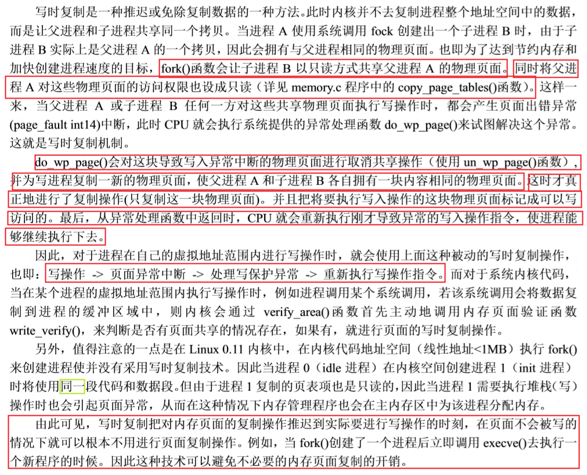

## `fork` 总体流程
- STEP1: 申请存放PCB的内存页：`fork()`首先会为新进程申请一页内存页用来复制父进程的任务数据结构（PCB）信息。
- STEP2：复制并初始化新进程数据：为新进程修改复制的任务数据结构的某些字段值，包括利用系统调用中断发生时逐步压入堆栈的寄存器信息(即`copy_process()`的参数）重新设置任务结构中的 TSS 结构的各字段值，让新进程的状态保持父进程即将进入中断过程前的状态。
- STEP3：确定新进程内存位置：为新进程确定在线性地址空间中的起始位置（nT* 64MB)。对于 CPU 的分段机制，Linux 0.11 的代码段和数据段在线性地址空间中的位置和长度完全相同。
- STEP4：复制页表项：接着系统会为新进程复制父进程的页目录项和页表项。对于 Linux 0.11 内核来说，所有程序共用一个位于物理内存开始位置处的页目录表，而新进程的页表则需另行申请一页内存来存放。

### Copy On Write
在 `fork()` 的执行过程中，内核并不会立刻为新进程分配代码和数据内存页。**新进程将与父进程共同使用父进程己有的代码和数据内存页面**。只有当以后执行过程中如果其中有一个进程**以写方式访问内存时被访问的内存页面才会在写操作前被复制到新申请的内存页面中**。

#### Copy Page Tables

