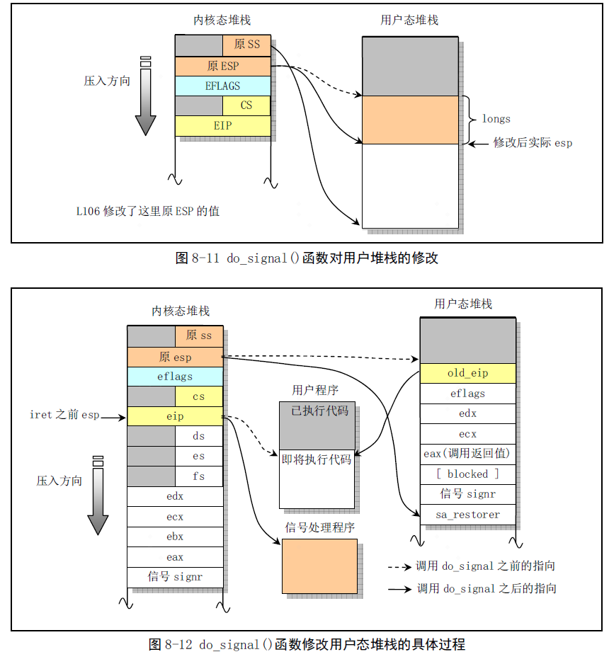
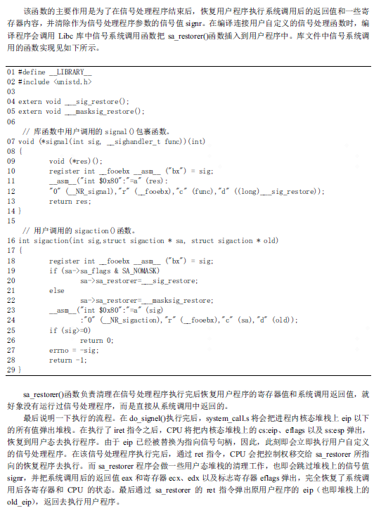

# 进程信号处理
> 本章节描述了信号处理的核心步骤，更加的解释见: [Linux 内核完全注释](https://github.com/lcdzhao/operating_system/tree/master/linux-0.1.1-labs/linux_0.1.1_%E6%B3%A8%E9%87%8A) 的第 8.8 章节(signal.c)

进程信号处理分为三个步骤： 
- STEP 1：注册信号处理函数：应用程序通过`signal`或者`sigaction`这两个系统调用注册自己的信号处理函数，如果应用程序自身没注册则使用默认的处理函数。
- STEP 2：发送信号：如`kill`等，发送信号是通过修改进程的`task_struct.singal`来进行信号传递。
- STEP 3：处理信号：操作系统内核通过`do_signal`来处理进程信号。
- STEP 4：从信号处理中恢复：通过`sa_restorer`来恢复用户寄存器值，以及去除当前信号的blocked位等。`sa_restorer`有编译器在链接阶段加入。具体见本章节最后一小节的说明。

## 注册信号处理函数
用户可以通过`signal`或者`sigaction`这两个系统调用来注册信号处理函数(具体区别见[Linux内核完全注释](https://github.com/lcdzhao/operating_system/tree/master/linux-0.1.1-labs/linux_0.1.1_%E6%B3%A8%E9%87%8A)第 8.8 章节(signal.c))。
```C
int sys_signal(int signum, long handler, long restorer)
{
	struct sigaction tmp;

	if (signum<1 || signum>32 || signum==SIGKILL)
		return -1;
	tmp.sa_handler = (void (*)(int)) handler;
	tmp.sa_mask = 0;
	tmp.sa_flags = SA_ONESHOT | SA_NOMASK;   //flags这种都是使用一个bit位来表示一个功能，极致地节省内存空间
	tmp.sa_restorer = (void (*)(void)) restorer;
	handler = (long) current->sigaction[signum-1].sa_handler;
	current->sigaction[signum-1] = tmp;
	return handler;
}

int sys_sigaction(int signum, const struct sigaction * action,
	struct sigaction * oldaction)
{
	struct sigaction tmp;

	if (signum<1 || signum>32 || signum==SIGKILL)
		return -1;
	tmp = current->sigaction[signum-1];
	get_new((char *) action,
		(char *) (signum-1+current->sigaction));
	if (oldaction)
		save_old((char *) &tmp,(char *) oldaction);
	if (current->sigaction[signum-1].sa_flags & SA_NOMASK)
		current->sigaction[signum-1].sa_mask = 0;
	else
		current->sigaction[signum-1].sa_mask |= (1<<(signum-1));  //通过sa_mask在do_singal中暂时阻塞重复的信号
	return 0;
}
```
`sigaction(include/signal.h)` 定义：
```C
struct sigaction {
	void (*sa_handler)(int);
	sigset_t sa_mask;
	int sa_flags;
	void (*sa_restorer)(void);  //由编译器在链接时指定，具体见本章节的最后一章
};
```

如果用户对某个信号没有注册具体的信号处理函数，则系统将会设置默认的信号处理函数`SIG_DFL`(0, 调用do_exit)或者`SIG_IGN`(1, 忽略信号)。代码(`kernel/signal.c`中的`do_signal`)如下:
```C
void do_signal(...)
{
	...
	if (sa_handler==1) // SIG_IGN
		return;
	if (!sa_handler) {  // SIG_DFL
		if (signr==SIGCHLD)
			return;
		else
			do_exit(1<<(signr-1));
	}
	...
}
```
## 发送信号
`kill`系统调用发送信号的流程为：`sys_kill(kernel/exit.c)` ——> `send_sig(kernel/exit.c)`。其中`send_sig`的代码如下:
```C
static inline int send_sig(long sig,struct task_struct * p,int priv)
{
	if (!p || sig<1 || sig>32)
		return -EINVAL;
	if (priv || (current->euid==p->euid) || suser())
		p->signal |= (1<<(sig-1));      //信号的发送实际上就是修改task_struct的signal字段
	else
		return -EPERM;
	return 0;
}
```
## 处理信号
信号的处理实际上通过`kernel/signal.c`中的`do_signal`方法，`do_signal`的执行流程：
 
 
 
`do_signal`源码：
```C
void do_signal(long signr,long eax, long ebx, long ecx, long edx,
	long fs, long es, long ds,
	long eip, long cs, long eflags,
	unsigned long * esp, long ss)
{
	unsigned long sa_handler;
	long old_eip=eip;
	struct sigaction * sa = current->sigaction + signr - 1;
	int longs;
	unsigned long * tmp_esp;

	sa_handler = (unsigned long) sa->sa_handler;
	if (sa_handler==1)
		return;
	if (!sa_handler) {
		if (signr==SIGCHLD)
			return;
		else
			do_exit(1<<(signr-1));
	}
	if (sa->sa_flags & SA_ONESHOT)    //使用这种位操作，来判断是否是ONESHOT
		sa->sa_handler = NULL;
	*(&eip) = sa_handler;  	   //采用这种写法直接修改内核栈中eip的值，最终从系统调用恢复时代码直接跳转到该位置
	longs = (sa->sa_flags & SA_NOMASK)?7:8;  //计算用户栈需要压栈几个参数，压栈的参数对应下面put_fs_long这几个
	*(&esp) -= longs;          //采用这种写法直接修改内核栈中esp的值，最终从系统调用恢复时用户栈直接跳转到该位置
	verify_area(esp,longs*4);
	tmp_esp=esp;             
	put_fs_long((long) sa->sa_restorer,tmp_esp++);
	put_fs_long(signr,tmp_esp++);
	if (!(sa->sa_flags & SA_NOMASK))          
		put_fs_long(current->blocked,tmp_esp++);
	put_fs_long(eax,tmp_esp++);
	put_fs_long(ecx,tmp_esp++);
	put_fs_long(edx,tmp_esp++);
	put_fs_long(eflags,tmp_esp++);
	put_fs_long(old_eip,tmp_esp++);
	current->blocked |= sa->sa_mask;   //有掩码时，在处理该信号的时候暂时阻塞掩码信号(掩码信号即为当前信号，通过sys_sigaction可以看出，sa_mask用来表示当前信号)
					   //否则的话可能会导致正在处理该信号时，突然新的该信号又到来，导致重复处理的信号处理
}
```

而调用`do_signal`的位置**有且只有**在`kernel/system_call.s`中的`ret_from_sys_call`中，具体如下:
```asm
ret_from_sys_call:
	...
	//通过下面这段代码来判断是否信号被屏蔽，如果被屏蔽则不跳转到do_signal
	movl signal(%eax),%ebx
	movl blocked(%eax),%ecx
	notl %ecx
	andl %ebx,%ecx
	bsfl %ecx,%ecx
	je 3f
	btrl %ecx,%ebx
	movl %ebx,signal(%eax)
	incl %ecx
	pushl %ecx
	call do_signal
  	...
```


 
### ret_from_sys_call的调用位置(`do_signal`的时机)
#### 系统调用
代码位置，`kernel/system_call.s`:
```asm
system_call:
	...
	cmpl $0,state(%eax)		# state
	jne reschedule
	cmpl $0,counter(%eax)		# counter
	je reschedule

reschedule:
	pushl $ret_from_sys_call
	jmp schedule
```
**因此在系统调用返回时，将会处理当前进程的信号。**
####  时钟中断
代码位置，`kernel/system_call.s`:
```asm
timer_interrupt:
	...
	call do_timer	//执行schedule方法
	...
	jmp ret_from_sys_call
```
**因此在时钟中断返回时(时钟中断中执行了schedule方法)，将会处理进程的信号。**
#### `TASK_INTERRUPTIBLE`的进程能否被快速`kill`掉
可以，在`kernel/sched.c`的`schedule`(调用链路：`timer_interrupt`->`do_timer`->`schedule`)方法中，执行了下面这段代码:
```C
void schedule(void)
{
	
	...
	for(p = &LAST_TASK ; p > &FIRST_TASK ; --p)
		if (*p) {
			...
			if (((*p)->signal & ~(_BLOCKABLE & (*p)->blocked)) &&
			(*p)->state==TASK_INTERRUPTIBLE)
				(*p)->state= TASK_RUNNING;   //将收到信号且信号未必屏蔽，且state为TASK_INTERRUPTIBLE的进程state改为TASK_RUNNING
 							     //正是这一段代码，使得TASK_INTERRUPTIBLE的进程也可以快速响应信号
		}

	...
}
```
#### `TASK_UNINTERRUPTIBLE`的进程能否被快速`kill`掉
不能，只有当该进程执行完`UNINTERRUPTIBLE`的操作，进程状态转换为`RUNNING`时，其才能在被`schedule`调度，然后通过`timer_interrupt`->`ret_from_sys_call`->`do_singal`的链路执行信号处理，从而结束进程。

## 从信号处理中恢复
通过`sa_restorer`来恢复用户寄存器值，以及去除当前信号的blocked位等。
 
 
