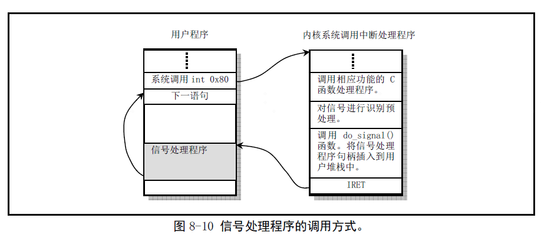

# 进程信号处理
> 对于代码更加详细的解释，见 [Linux内核完全注释](https://github.com/lcdzhao/operating_system/tree/master/linux-0.1.1-labs/linux_0.1.1_%E6%B3%A8%E9%87%8A)第 8.8 章节(signal.c)

## 进程信号处理流程
### 注册信号处理函数
用户可以通过`signal`或者`sigaction`这两个系统调用来注册信号处理函数(具体区别见[Linux内核完全注释](https://github.com/lcdzhao/operating_system/tree/master/linux-0.1.1-labs/linux_0.1.1_%E6%B3%A8%E9%87%8A)第 8.8 章节(signal.c))。

如果用户对某个信号没有注册具体的信号处理函数，则系统将会设置默认的信号处理函数`SIG_DFL`(0, 调用do_exit)或者`SIG_IGN`(1, 忽略信号)。代码(`kernel/signal.c`中的`do_signal`)如下:
```C
void do_signal(...)
{
	...
	if (sa_handler==1) // SIG_IGN
		return;
	if (!sa_handler) {  // SIG_DFL
		if (signr==SIGCHLD)
			return;
		else
			do_exit(1<<(signr-1));
	}
	...
}
```
### 发送信号
`kill`系统调用发送信号的流程为：`sys_kill(kernel/exit.c)` ——> `send_sig(kernel/exit.c)`。其中`send_sig`的代码如下:
```
static inline int send_sig(long sig,struct task_struct * p,int priv)
{
	if (!p || sig<1 || sig>32)
		return -EINVAL;
	if (priv || (current->euid==p->euid) || suser())
		p->signal |= (1<<(sig-1));      //信号的发送实际上就是修改task_struct的signal字段
	else
		return -EPERM;
	return 0;
}
```
### 处理信号
信号的处理实际上通过`kernel/signal.c`中的`do_signal`方法执行，而调用`do_signal`的位置在`kernel/system_call.s`中的`ret_from_sys_call`中，具体如下:
```asm
ret_from_sys_call:
	...
	call do_signal
	popl %eax
  ...
```

`do_signal`的执行流程：
 
 
#### ret_from_sys_call的调用位置(`do_signal`的时机)
##### 系统调用
代码位置，`kernel/system_call.s`:
```asm
system_call:
	...
	cmpl $0,state(%eax)		# state
	jne reschedule
	cmpl $0,counter(%eax)		# counter
	je reschedule

reschedule:
	pushl $ret_from_sys_call
	jmp schedule
```
即：在系统调用时，将会处理当前进程的信号。
#####  时钟中断
代码位置，`kernel/system_call.s`:
```
timer_interrupt:
	...
	call do_timer	//执行schedule方法
	...
	jmp ret_from_sys_call
```
即：在时钟中断时(进程调度)，将会处理当前进程的信号。
#### `TASK_INTERRUPTIBLE`的进程能否被快速`kill`掉
可以，在`kernel/sched.c`的`schedule`(调用链路：`timer_interrupt`->`do_timer`->`schedule`)方法中，执行了下面这段代码:
```C
void schedule(void)
{
	
	...
	for(p = &LAST_TASK ; p > &FIRST_TASK ; --p)
		if (*p) {
			...
			if (((*p)->signal & ~(_BLOCKABLE & (*p)->blocked)) &&
			(*p)->state==TASK_INTERRUPTIBLE)
				(*p)->state=TASK_RUNNING;   //将收到信号且state为TASK_INTERRUPTIBLE的进程state改为TASK_RUNNING
							    //正是这一段代码，使得TASK_INTERRUPTIBLE的进程也可以快速响应信号
		}

	...
}
```
#### `TASK_UNINTERRUPTIBLE`的进程能否被快速`kill`掉
不能，只有当该进程执行完`UNINTERRUPTIBLE`的操作，进程状态转换为其他状态时，其才能执行`do_singal`方法，从而处理`kill`信号，结束进程。
